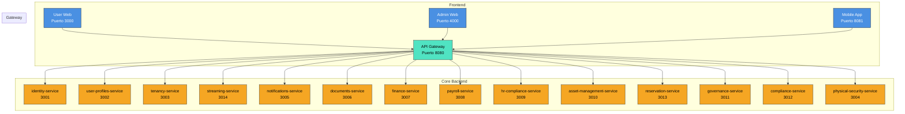

# 📘 **SmartEdify Global — Especificación Técnica del Sistema**

> **Estado:** `Vision Global - Para inicio del desarrollo spec`  
> **Alcance:** Plataforma Global de Gobernanza y Gestión de Condominios Multi-País  
> **Visión:** Convertir a SmartEdify en el sistema operativo digital para comunidades residenciales y comerciales en Latinoamérica y Europa, garantizando cumplimiento legal local, transparencia operativa y participación comunitaria inteligente.

---

## 🎯 **1. Visión del Producto**

SmartEdify es una **plataforma SaaS global de gobernanza y gestión comunitaria** diseñada para digitalizar, automatizar y hacer **jurídicamente válida** la administración de condominios en Perú, con capacidad de expansión a Latinoamérica y Europa.

Su objetivo es convertirse en el **sistema operativo digital para comunidades**, combinando:

*   **Gobernanza Democrática Digital con Validez Legal:** Asambleas híbridas (presencial/virtual/mixta) con flujos legales adaptativos, votación ponderada, validación de quórum vinculada criptográficamente al video, y generación de actas con IA.
*   **Gestión Operativa Inteligente e Inclusiva:** Mantenimiento predictivo, reservas de áreas comunes, seguridad física integrada, y soporte para votación asistida (moderador, biometría, SMS).
*   **Cumplimiento Normativo Adaptativo:** Motor legal dinámico (`compliance-service`) que se adapta a las regulaciones locales sin reescribir el núcleo del sistema.
*   **Experiencia de Usuario Centrada en la Comunidad:** Gamificación con recompensas tangibles, notificaciones personalizadas, y una UI/UX optimizada para reducir la fricción tecnológica.

---

## 🏗️ **2. Arquitectura General**

### **2.1. Patrones Arquitectónicos**

| Patrón | Implementación | Justificación |
|--------|----------------|---------------|
| **Microservicios** | 14 servicios independientes, cada uno con su propia base de datos y ciclo de vida. | Escalabilidad, despliegue independiente, aislamiento de fallos. |
| **API Gateway** | Punto de entrada único para todos los clientes (web, móvil, terceros). | Centralización de seguridad, enrutamiento, rate limiting. |
| **Event-Driven** | Comunicación asíncrona vía RabbitMQ. Registro y validación de esquemas en `notifications-service`. | Desacoplamiento, resiliencia, escalabilidad horizontal. |
| **Multi-Tenant** | Modelo: *Shared Database, Shared Schema* con discriminador `condominium_id` + RLS. | Eficiencia operativa, escalabilidad a miles de tenants. |
| **Frontend Monorepo** | Aplicaciones: User Web, Admin Web, Mobile App (React/React Native). | Reutilización de código, consistencia UX, despliegue coordinado. |

### **2.2. Componentes Principales (Diagrama Mermaid)**

---

## 📦 **3. Alcance de Microservicios (14 Servicios) — ¡REVISIÓN 1.0!**

Cada servicio es autónomo, desplegable de forma independiente, y sigue el principio de responsabilidad única. **Los cambios clave respecto a versiones anteriores están marcados con 🆕.**

---

### **3.1. `gateway-service` (Puerto 8080)**

*   **Alcance:** Punto de entrada único. Enrutamiento, autenticación JWT, rate limiting, CORS.
*   **Responsabilidades Clave:** Proxy inverso, extracción de `tenant_id` del token, propagación de contexto.

---

### **3.2. `identity-service` (Puerto 3001)**

*   **Alcance:** Gestión de identidad digital. Login, registro, MFA, OAuth2/OIDC, RBAC/ABAC.
*   **Responsabilidades Clave:** Autenticación, autorización, gestión de sesiones, cumplimiento ARCO/GDPR.
*   **🆕 Mejora Revisión 1.0:** Soporte para registro y validación de credenciales biométricas (Touch ID, Face ID) para integración con `streaming-service`.

---

### **3.3. `user-profiles-service` (Puerto 3002)**

*   **Alcance:** Perfiles de usuario, roles por condominio, estructura organizacional (Junta Directiva, Comités).
*   **Responsabilidades Clave:** CRUD de perfiles, gestión de relaciones, fuente canónica de datos de usuario.

---

### **3.4. `tenancy-service` (Puerto 3003)**

*   **Alcance:** Ciclo de vida de condominios. Unidades, alícuotas, onboarding, configuración dinámica.
*   **Responsabilidades Clave:** Creación de tenants, cálculo de alícuotas, aislamiento de datos.

---

### **3.5. `streaming-service` (Puerto 3014) — ¡NUEVO EN SCOPE!**

*   **Alcance:** Gestión de sesiones de video en vivo para asambleas híbridas. Integración con Google Meet, generación y validación de QR, transcripción en tiempo real, grabación segura, y control de moderación.
*   **Responsabilidades Clave:**
    *   Iniciar/terminar sesiones de video.
    *   **🆕 Generar QR dinámicos para validación de asistencia (escaneable desde el mismo dispositivo).**
    *   **🆕 Validar asistencia mediante biometría (huella/rostro) o código SMS/Email como alternativas al QR.**
    *   Integrar Speech-to-Text para transcripción en vivo.
    *   Grabar, cifrar y almacenar videos con hash de verificación.
    *   Proporcionar controles de moderación (silenciar, ceder palabra, cronómetro).
    *   **🆕 Gestionar el “Modo Presencial” para que el moderador registre asistentes y votos manuales.**
*   **Justificación:** Separado del `governance-service` para cumplir con SRP, permitir reutilización y manejar la complejidad técnica del streaming de forma aislada.

---

### **3.6. `physical-security-service` (Puerto 3004)**

*   **Alcance:** Seguridad física del condominio. CCTV, control de accesos (huella, facial), sensores IoT, protocolos de riesgo.
*   **Responsabilidades Clave:** Integración con hardware, detección de amenazas, alertas en tiempo real.

---

### **3.7. `notifications-service` (Puerto 3005)**

*   **Alcance:** Envío de notificaciones (email, SMS, push). Registro y validación de esquemas de eventos (Event Schema Registry).
*   **Responsabilidades Clave:** Multicanal, gestión de plantillas, muro de noticias virtual.
*   **🆕 Mejora Revisión 1.0:** Soporte para enviar códigos de verificación de 6 dígitos para validación de asistencia vía SMS/Email.

---

### **3.8. `documents-service` (Puerto 3006)**

*   **Alcance:** Gestión de documentos legales. Almacenamiento (S3), generación desde plantillas, flujos de firma electrónica.
*   **Responsabilidades Clave:** Generación de actas, contratos, carteles de convocatoria. Integración con Llama.pe.
*   **🆕 Mejora Revisión 1.0:** Adjuntar automáticamente fotos de papeletas físicas (votos presenciales) como anexos en el PDF del acta.

---

### **3.9. `finance-service` (Puerto 3007)**

*   **Alcance:** Gestión financiera. Cuotas de mantenimiento, conciliación bancaria, reportes contables (PCGE, NIIF), impuestos.
*   **Responsabilidades Clave:** Cálculo de cuotas, procesamiento de pagos, validación de quórum para votaciones (solo propietarios “habilitados”).

---

### **3.10. `payroll-service` (Puerto 3008)**

*   **Alcance:** Cálculo y procesamiento de nóminas. Generación de PLAME y formatos equivalentes por país.
*   **Responsabilidades Clave:** Cálculo de salarios, beneficios, impuestos. Integración con `finance-service`.

---

### **3.11. `hr-compliance-service` (Puerto 3009)**

*   **Alcance:** Gestión del ciclo de vida del empleado y cumplimiento laboral. Contratos, evaluaciones, SST, comités.
*   **Responsabilidades Clave:** Cumplimiento normativo laboral, gestión de riesgos, reportes de inspección.

---

### **3.12. `asset-management-service` (Puerto 3010)**

*   **Alcance:** Inventario de activos (hard y soft). Órdenes de trabajo (preventivas y correctivas), gestión de proveedores.
*   **Responsabilidades Clave:** Jerarquía de activos, mantenimiento, indicadores de disponibilidad.
*   **Integración Clave:** `reservation-service` (las áreas comunes son activos).

---

### **3.13. `governance-service` (Puerto 3011) — ¡REVISIÓN 1.0 COMPLETA!**

*   **Alcance:** Ciclo completo de asambleas con **validez legal peruana garantizada**. Gestión de iniciativas de convocatoria, flujos de aprobación, votación ponderada, generación de actas con IA (MCP), y moderación híbrida.
*   **Responsabilidades Clave:**
    *   **🆕 Flujos de Convocatoria Legalmente Alineados:**
        *   **Iniciativa de Convocatoria:** Creada por cualquier propietario, con orden del día estructurado (informativos/votables).
        *   **Recolección de Adhesiones:** Los propietarios “adhieren” (no votan) hasta alcanzar el 25% de alícuotas.
        *   **Convocatoria Obligatoria:** Al alcanzar el 25%, el sistema notifica al Administrador, quien **tiene la obligación legal** de emitir la convocatoria formal en 15 días.
    *   **Validación Legal Dinámica:** Consulta al `compliance-service` para validar quórum, mayorías y flujos en tiempo real. **Ningún valor está hardcoded.**
    *   **Gestión de Sesiones Híbridas (con `streaming-service`):**
        *   **Validación de Asistencia:** Solo los usuarios validados (QR, biometría, SMS) cuentan para el quórum.
        *   **Moderación Híbrida:** Sistema automático (cola FIFO) + intervención manual del moderador (réplicas, ampliaciones).
        *   **Votación Presencial Registrada por Moderador (Modo Mixta):** El moderador puede registrar manualmente a asistentes presenciales y sus votos, adjuntando fotos de papeletas.
    *   **Auditoría Legal Inmutable:**
        *   **Sello de Quórum:** Al cerrar la votación, se genera un hash criptográfico del estado del quórum, que se incrusta en los metadatos del video.
        *   **Snapshot de Quórum:** Se genera un PDF con la lista de asistentes y alícuotas en el momento del cierre, que se adjunta al acta.
    *   **Generación de Actas con IA (MCP):** El MCP genera un borrador a partir de la transcripción. El acta final es aprobada y firmada por el Presidente y el Secretario.
    *   **Gamificación con Recompensas Tangibles:** Los puntos se pueden canjear por descuentos en cuotas (integración con `finance-service`).
*   **Dependencias Clave:** `streaming-service`, `compliance-service`, `documents-service`, `finance-service`, `user-profiles-service`.

---

### **3.14. `reservation-service` (Puerto 3013)**

*   **Alcance:** Gestión de reservas de áreas comunes. Calendario, reglas de uso, validación de conflictos.
*   **Responsabilidades Clave:** Reservas, recordatorios, integración con `asset-management-service`.

---

### **3.15. `compliance-service` (Puerto 3012)**

*   **Alcance:** **Motor de Cumplimiento Normativo Global.** Valida reglas legales (financieras, laborales, de asambleas) basadas en el país del tenant y su reglamento interno. Usa motor de reglas + LLM.
*   **Responsabilidades Clave:**
    *   Definir y validar flujos de aprobación de convocatorias.
    *   Inyectar dinámicamente quórum y mayorías requeridas para cada tipo de decisión.
    *   Gestionar perfiles regulatorios por país y tipo de propiedad.
    *   Adaptación multi-país.

Adiciones
---
### **3.16. `marketplace-service` (Puerto 3013)**
 **Alcance:Permite a los administradores y propietarios contratar servicios legales, de mantenimiento, asesoría financiera, etc., directamente desde la plataforma, generando una comisión recurrente para SmartEdify. pero se expande a maintenance, rrhh-service
Beneficios Clave:

---
### **3.17. `analytics-service` (Puerto 3014)**
 **Alcance:Proporciona insights predictivos y descriptivos sobre la participación, los temas más votados, la satisfacción de los propietarios, etc., permitiendo a las juntas directivas tomar decisiones proactivas y a SmartEdify ofrecer módulos premium de inteligencia de negocio. pero se expande a maintenance, rrhh-service
Monetización: Nuevos flujos de ingresos por comisiones y suscripciones premium.
*    **Engagement: Los propietarios ven valor añadido más allá de la votación.
*    **Toma de Decisiones: Las juntas directivas pueden actuar con base en datos, no en intuición.
*    **Diferenciación Competitiva: SmartEdify no es solo un software de asambleas; es una plataforma de servicios y datos para comunidades inteligentes.
---
## 🌐 **4. Estrategia Multi-País y Localización**

*   **Motor de Cumplimiento (`compliance-service`):** Define perfiles regulatorios por país (Perú, Chile, México, España, etc.) y tipo de propiedad.
*   **Localización de UI:** Traducción de interfaces con `i18next`.
*   **Formatos Legales:** Plantillas de documentos y reportes adaptadas por jurisdicción.
*   **Moneda y Fecha:** Configurables por tenant.

---

## 🛡️ **5. Seguridad y Cumplimiento**

*   **Autenticación:** JWT + MFA + Biometría (opcional).
*   **Autorización:** RBAC/ABAC con políticas dinámicas.
*   **Cifrado:** AES-256 en reposo, TLS 1.3 en tránsito.
*   **Auditoría:** Trazas inmutables (Event Sourcing) para todas las operaciones críticas.
*   **Privacidad:** Cumplimiento con GDPR, LGPD, Ley 29733. Consentimientos explícitos para grabación de video y uso de biometría.

---

## 🚀 **6. Infraestructura y Operaciones**

*   **Backend:** Node.js + NestJS.
*   **Frontend:** React + React Native + TypeScript.
*   **Base de Datos:** PostgreSQL (por servicio) + RLS.
*   **Mensajería:** RabbitMQ.
*   **Almacenamiento:** AWS S3.
*   **Infraestructura:** Docker + Kubernetes + AWS.
*   **Observabilidad:** Prometheus + Grafana + OpenTelemetry + ELK.

---

## ✅ **7. Criterios de Aceptación (Definition of Done)**

Para que un microservicio se considere “completo” y listo para producción, debe cumplir con:

1.  **Funcionalidad:** Todas las historias de usuario del alcance están implementadas y probadas.
2.  **API:** Contrato de API definido en OpenAPI/Swagger y publicado.
3.  **Pruebas:** >80% de cobertura de pruebas unitarias e integración. Pruebas E2E para flujos críticos.
4.  **Observabilidad:** Métricas, logs estructurados y trazas distribuidas implementadas.
5.  **Seguridad:** Auditoría de seguridad completada. No hay vulnerabilidades críticas.
6.  **Documentación:** README.md con instrucciones de despliegue, configuración y uso.
7.  **CI/CD:** Pipeline automatizado de build, test y despliegue.

---

## 📅 **8. Hoja de Ruta (Roadmap) — Visión Global**

*   **Trimestre 1:** Lanzamiento en Perú (PMV: `governance-service`, `reservation-service`, `asset-management-service` + `streaming-service`).
*   **Trimestre 2:** Expansión a Chile y Colombia. Adaptación de `compliance-service`.
*   **Trimestre 3:** Lanzamiento en México y España. Integración con proveedores locales.
*   **Año 2:** Expansión a Brasil y resto de LATAM. Soporte para LGPD.
*   **Año 3:** Entrada en mercado Europeo. Cumplimiento con GDPR y normativas de eficiencia energética.

---

## 📌 **9. Exclusiones (Out of Scope)**

*   Desarrollo de hardware (cámaras, sensores, cerraduras).
*   Provisión de servicios de internet o conectividad para los condominios.
*   Gestión de propiedades individuales (no comunes) dentro de los departamentos.
*   Contabilidad personal de los propietarios (solo la relacionada con el condominio).
*   Reemplazo de abogados o asesores legales humanos (el sistema asiste, no reemplaza).

---

## ✅ **10. Conclusión**

Esta **Revisión 1.0** del `SCOPE.md` define a SmartEdify como una **plataforma global, resiliente y legalmente adaptable**. La arquitectura de 14 microservicios, con las mejoras críticas implementadas en el `governance-service` y el `streaming-service`, permite una expansión ágil y segura a nuevos mercados, convirtiendo los desafíos regulatorios y técnicos en una ventaja competitiva insuperable.

La plataforma no solo digitaliza procesos; **reinventa la forma en que las comunidades se gobiernan, operan y cumplen con la ley en un mundo multi-jurisdiccional, con un enfoque profundo en la inclusión, la accesibilidad y la validez legal irrefutable**.

---

**© 2025 SmartEdify Global. Todos los derechos reservados.**  
*Documento generado automáticamente a partir de la especificación técnica.*
