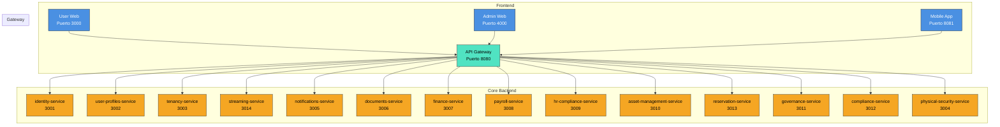

# 📘 **SmartEdify Global — Especificación Técnica del Sistema**

> **Estado:** `Vision Global - Para inicio del desarrollo spec`  
> **Alcance:** Plataforma Global de Gobernanza y Gestión de Condominios Multi-País  
> **Visión:** Convertir a SmartEdify en el sistema operativo digital para comunidades residenciales y comerciales en Latinoamérica y Europa, garantizando cumplimiento legal local, transparencia operativa y participación comunitaria inteligente.

---

## 🎯 **1. Visión del Producto**

SmartEdify es una **plataforma SaaS global de gobernanza y gestión comunitaria** diseñada para digitalizar, automatizar y hacer transparente la administración de condominios, edificios corporativos y complejos residenciales en múltiples jurisdicciones.

Su objetivo es convertirse en el **sistema operativo digital para comunidades**, combinando:

*   **Gobernanza Democrática Digital:** Asambleas híbridas (presencial/virtual/mixta) con votación ponderada, validación legal en tiempo real y generación de actas con IA.
*   **Gestión Operativa Inteligente:** Mantenimiento predictivo, reservas de áreas comunes, seguridad física integrada.
*   **Cumplimiento Normativo Adaptativo:** Motor legal dinámico que se adapta a las regulaciones locales (Perú, Chile, México, España, etc.) sin reescribir el núcleo del sistema.
*   **Experiencia de Usuario Centrada en la Comunidad:** Gamificación, notificaciones personalizadas, marketplace integrado y diseño móvil-first.

---

## 🏗️ **2. Arquitectura General**

### **2.1. Patrones Arquitectónicos**

| Patrón | Implementación | Justificación |
|--------|----------------|---------------|
| **Microservicios** | 14 servicios independientes, cada uno con su propia base de datos y ciclo de vida. | Escalabilidad, despliegue independiente, aislamiento de fallos. |
| **API Gateway** | Punto de entrada único para todos los clientes (web, móvil, terceros). | Centralización de seguridad, enrutamiento, rate limiting. |
| **Event-Driven** | Comunicación asíncrona vía RabbitMQ. Registro de esquemas en `notifications-service`. | Desacoplamiento, resiliencia, escalabilidad horizontal. |
| **Multi-Tenant** | Modelo: *Shared Database, Shared Schema* con discriminador `condominium_id` + RLS. | Eficiencia operativa, escalabilidad a miles de tenants. |
| **Frontend Monorepo** | Aplicaciones: User Web, Admin Web, Mobile App (React/React Native). | Reutilización de código, consistencia UX, despliegue coordinado. |

### **2.2. Componentes Principales**

---

## 📦 **3. Alcance de Microservicios (14 Servicios)**

Cada servicio es autónomo, desplegable de forma independiente, y sigue el principio de responsabilidad única.

---

### **3.1. `gateway-service` (Puerto 8080)**

*   **Alcance:** Punto de entrada único. Enrutamiento, autenticación JWT, rate limiting, CORS.
*   **Responsabilidades Clave:** Proxy inverso, extracción de `tenant_id` del token, propagación de contexto.

---

### **3.2. `identity-service` (Puerto 3001)**

*   **Alcance:** Gestión de identidad digital. Login, registro, MFA, OAuth2/OIDC, RBAC/ABAC.
*   **Responsabilidades Clave:** Autenticación, autorización, gestión de sesiones, cumplimiento ARCO/GDPR.

---

### **3.3. `user-profiles-service` (Puerto 3002)**

*   **Alcance:** Perfiles de usuario, roles por condominio, estructura organizacional (Junta Directiva, Comités).
*   **Responsabilidades Clave:** CRUD de perfiles, gestión de relaciones, fuente canónica de datos de usuario.

---

### **3.4. `tenancy-service` (Puerto 3003)**

*   **Alcance:** Ciclo de vida de condominios. Unidades, alícuotas, onboarding, configuración dinámica.
*   **Responsabilidades Clave:** Creación de tenants, cálculo de alícuotas, aislamiento de datos.

---

### **3.5. `streaming-service` (Puerto 3014) — ¡NUEVO!**

*   **Alcance:** Gestión de sesiones de video en vivo para asambleas híbridas. Integración con Google Meet, generación y validación de QR, transcripción en tiempo real, grabación segura.
*   **Responsabilidades Clave:**
    *   Iniciar/terminar sesiones de video.
    *   Generar QR dinámicos para validación de identidad y quórum.
    *   Integrar Speech-to-Text para transcripción en vivo.
    *   Grabar, cifrar y almacenar videos con hash de verificación.
    *   Proporcionar controles de moderación (silenciar, ceder palabra).
*   **Justificación:** Separado del `governance-service` para cumplir con SRP, permitir reutilización y manejar la complejidad técnica del streaming de forma aislada.

---

### **3.6. `physical-security-service` (Puerto 3004)**

*   **Alcance:** Seguridad física del condominio. CCTV, control de accesos (huella, facial), sensores IoT, protocolos de riesgo.
*   **Responsabilidades Clave:** Integración con hardware, detección de amenazas, alertas en tiempo real.

---

### **3.7. `notifications-service` (Puerto 3005)**

*   **Alcance:** Envío de notificaciones (email, SMS, push). Registro y validación de esquemas de eventos (Event Schema Registry).
*   **Responsabilidades Clave:** Multicanal, gestión de plantillas, muro de noticias virtual.

---

### **3.8. `documents-service` (Puerto 3006)**

*   **Alcance:** Gestión de documentos legales. Almacenamiento (S3), generación desde plantillas, flujos de firma electrónica.
*   **Responsabilidades Clave:** Generación de actas, contratos, carteles de convocatoria. Integración con Llama.pe.

---

### **3.9. `finance-service` (Puerto 3007)**

*   **Alcance:** Gestión financiera. Cuotas de mantenimiento, conciliación bancaria, reportes contables (PCGE, NIIF), impuestos.
*   **Responsabilidades Clave:** Cálculo de cuotas, procesamiento de pagos, validación de quórum para votaciones.

---

### **3.10. `payroll-service` (Puerto 3008)**

*   **Alcance:** Cálculo y procesamiento de nóminas. Generación de PLAME y formatos equivalentes por país.
*   **Responsabilidades Clave:** Cálculo de salarios, beneficios, impuestos. Integración con `finance-service`.

---

### **3.11. `hr-compliance-service` (Puerto 3009)**

*   **Alcance:** Gestión del ciclo de vida del empleado y cumplimiento laboral. Contratos, evaluaciones, SST, comités.
*   **Responsabilidades Clave:** Cumplimiento normativo laboral, gestión de riesgos, reportes de inspección.

---

### **3.12. `asset-management-service` (Puerto 3010)**

*   **Alcance:** Inventario de activos (hard y soft). Órdenes de trabajo (preventivas y correctivas), gestión de proveedores.
*   **Responsabilidades Clave:** Jerarquía de activos, mantenimiento, indicadores de disponibilidad.

---

### **3.13. `governance-service` (Puerto 3011)**

*   **Alcance:** Ciclo completo de asambleas. Convocatoria con flujos legales (Presidente / 25% propietarios), votación ponderada, generación de actas con IA (MCP).
*   **Responsabilidades Clave:**
    *   Flujos de aprobación de convocatorias.
    *   Validación de quórum en tiempo real.
    *   Orquestación de votaciones.
    *   Integración con `streaming-service` para asambleas híbridas.
    *   Generación de borradores de actas con NLP.
*   **Dependencias Clave:** `streaming-service`, `compliance-service`, `documents-service`, `finance-service`.

---

### **3.14. `reservation-service` (Puerto 3013)**

*   **Alcance:** Gestión de reservas de áreas comunes. Calendario, reglas de uso, validación de conflictos.
*   **Responsabilidades Clave:** Reservas, recordatorios, integración con `asset-management-service`.

---

### **3.15. `compliance-service` (Puerto 3012)**

*   **Alcance:** Motor de Cumplimiento Normativo Global. Valida reglas legales (financieras, laborales, de asambleas) basadas en el país del tenant y su reglamento interno. Usa motor de reglas + LLM.
*   **Responsabilidades Clave:** Validación legal en tiempo real, gestión de perfiles regulatorios, adaptación multi-país.

---

## 🌐 **4. Estrategia Multi-País y Localización**

*   **Motor de Cumplimiento (`compliance-service`):** Define perfiles regulatorios por país (Perú, Chile, México, España, etc.) y tipo de propiedad.
*   **Localización de UI:** Traducción de interfaces con `i18next`.
*   **Formatos Legales:** Plantillas de documentos y reportes adaptadas por jurisdicción.
*   **Moneda y Fecha:** Configurables por tenant.

---

## 🛡️ **5. Seguridad y Cumplimiento**

*   **Autenticación:** JWT + MFA.
*   **Autorización:** RBAC/ABAC con políticas dinámicas.
*   **Cifrado:** AES-256 en reposo, TLS 1.3 en tránsito.
*   **Auditoría:** Trazas inmutables para todas las operaciones críticas (event sourcing).
*   **Privacidad:** Cumplimiento con GDPR, LGPD, Ley 29733. Consentimientos explícitos.

---

## 🚀 **6. Infraestructura y Operaciones**

*   **Backend:** Node.js + NestJS.
*   **Frontend:** React + React Native + TypeScript.
*   **Base de Datos:** PostgreSQL (por servicio) + RLS.
*   **Mensajería:** RabbitMQ.
*   **Almacenamiento:** AWS S3.
*   **Infraestructura:** Docker + Kubernetes + AWS.
*   **Observabilidad:** Prometheus + Grafana + OpenTelemetry + ELK.

---

## ✅ **7. Criterios de Aceptación (Definition of Done)**

Para que un microservicio se considere “completo” y listo para producción, debe cumplir con:

1.  **Funcionalidad:** Todas las historias de usuario del alcance están implementadas y probadas.
2.  **API:** Contrato de API definido en OpenAPI/Swagger y publicado.
3.  **Pruebas:** >80% de cobertura de pruebas unitarias e integración. Pruebas E2E para flujos críticos.
4.  **Observabilidad:** Métricas, logs estructurados y trazas distribuidas implementadas.
5.  **Seguridad:** Auditoría de seguridad completada. No hay vulnerabilidades críticas.
6.  **Documentación:** README.md con instrucciones de despliegue, configuración y uso.
7.  **CI/CD:** Pipeline automatizado de build, test y despliegue.

---

## 📅 **8. Hoja de Ruta (Roadmap) — Visión Global**

*   **Fase 1:** Lanzamiento  (MVP: `governance`, `reservation`, `asset-management` + `compliance` básico), con los soportes necesarios minimos
*   **Fase 2:** Completar `compliance-service` y `finance-service`.
*   **Fase 3:** Desarrollar 'payroll-service', 'hr-compliance-service'
*   **Fase 4:** Implementar el 100% de los microservicios
*   **Fase 5:** Retroalimentacion y mejoras

---

## 📌 **9. Exclusiones (Out of Scope)**

*   Desarrollo de hardware (cámaras, sensores, cerraduras).
*   Provisión de servicios de internet o conectividad para los condominios.
*   Gestión de propiedades individuales (no comunes) dentro de los departamentos.
*   Contabilidad personal de los propietarios (solo la relacionada con el condominio).
*   Reemplazo de abogados o asesores legales humanos (el sistema asiste, no reemplaza).

---

## ✅ **10. Conclusión**

Esta especificación de alcance define a SmartEdify como una **plataforma global, resiliente y legalmente adaptable**. La arquitectura de 14 microservicios, con la introducción crítica del `streaming-service` como componente independiente, permite una expansión ágil y segura a nuevos mercados, convirtiendo los desafíos regulatorios y técnicos en una ventaja competitiva insuperable.

La plataforma no solo digitaliza procesos; **reinventa la forma en que las comunidades se gobiernan, operan y cumplen con la ley en un mundo multi-jurisdiccional.**

---

**© 2025 SmartEdify Global. Todos los derechos reservados.**  
*Documento generado automáticamente a partir de la especificación técnica.*
