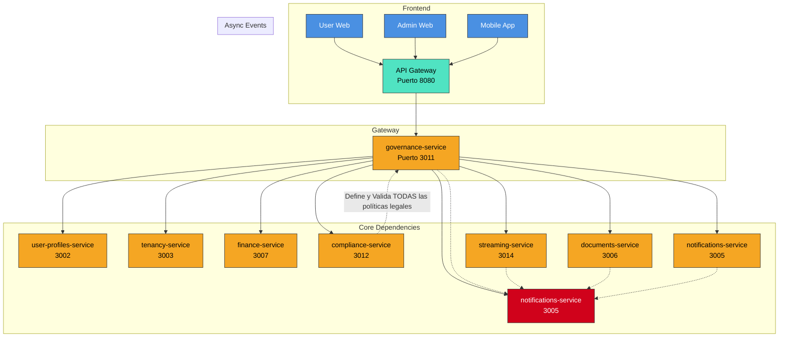

# 📘 **Especificación Técnica: `governance-service` (Puerto 3011) — Versión 3.0**
> **Metodología:** `github/spec-kit`  
> **Versión:** `3.0`  
> **Estado:** `Vision Global - Para inicio del desarrollo spec`  
> **Última Actualización:** `2025-04-05`  
> **Alcance Global:** Plataforma de Gobernanza Comunitaria Internacional para Asambleas Híbridas (Presencial/Virtual/Mixta) con Validación Legal Adaptativa, Moderación Inteligente, Auditoría Inmutable y Soporte para Participación Inclusiva.  
> **Visión Internacional:** Diseñar un sistema jurídicamente agnóstico que se adapte dinámicamente a cualquier marco regulatorio local (Perú, Chile, México, España, Brasil, etc.) mediante el motor de cumplimiento (`compliance-service`), garantizando transparencia, trazabilidad y validez legal universal.
---
## 🧭 **1. Visión y Justificación Global (Corregida)**

El `governance-service` es el **corazón democrático y legal** de SmartEdify a nivel global. Su misión es **ejecutar fielmente** el ciclo de vida completo de las asambleas de propietarios — desde la iniciativa de convocatoria hasta la generación del acta final — de manera **totalmente digital, técnicamente robusta y legalmente verificable**.

Este servicio **NO es agnóstico en su ejecución**. Es un **ejecutor estricto de políticas**. Toda lógica de negocio (flujos, quórum, mayorías, plazos, métodos de votación, secreto del voto) **debe ser proporcionada y validada en tiempo real por el `compliance-service`**. Si el `compliance-service` no proporciona una política válida y firmada para una operación, el `governance-service` **bloquea la operación**.

**Principios Fundamentales Corregidos:**
*   **Ejecución de Políticas, No Definición:** El servicio no define reglas. Solo las ejecuta según las políticas (`policy_id`) proporcionadas por el `compliance-service`.
*   **Inclusión Universal con Privacidad:** Soporta múltiples métodos de participación, pero **minimiza y protege los datos personales**. Las evidencias físicas (papeletas) se manejan como datos sensibles.
*   **Auditoría Inmutable y Verificable:** Cada acción, voto y decisión queda registrada en una cadena de custodia digital (event sourcing) y vinculada criptográficamente a la grabación de video mediante pruebas verificables (COSE/JWS, Merkle).
*   **Transparencia Radical con Seguridad:** Todos los propietarios pueden verificar la integridad de la grabación y el acta, pero solo mediante mecanismos seguros (tokens PoP, firmas digitales).
*   **Participación Proactiva con IA Asistida:** El “Canal de Aportes” y el MCP (Motor de Cumplimiento y Procesamiento) son herramientas de asistencia, **no reemplazan la revisión y aprobación humana**.

---

## 🏗️ **2. Arquitectura y Diseño Global (Corregido)**

### **2.1. Patrones Arquitectónicos Clave (Corregidos)**

| Patrón | Implementación | Justificación |
|--------|----------------|---------------|
| **Microservicio RESTful + WebSocket** | API síncrona para CRUD y orquestación. WebSocket para actualizaciones en tiempo real (quórum, turno de palabra, votos presenciales). | Soporta interacciones en vivo sin bloquear la API. |
| **Event-Driven Architecture** | Emite eventos a **Apache Kafka** con **exactly-once semantics** y particionamiento por `assembly_id`. | Mayor throughput, persistencia, tolerancia a fallos y **consistencia garantizada** para flujos críticos. |
| **CQRS + Event Sourcing** | Separación de modelos para escritura (gestión de asambleas) y lectura (dashboards, listados). Eventos inmutables para auditoría legal. | Permite reconstruir el estado de cualquier asamblea para una auditoría forense. **Garantiza idempotencia y deduplicación**. |
| **Saga Pattern** | Orquesta flujos complejos: aprobar iniciativa → emitir convocatoria → generar PDF → firmar → generar sello de quórum → grabar video → notificar → consolidar aportes. | Garantiza consistencia en operaciones distribuidas. **Requiere veredicto legal firmado para cerrar la saga**. |
| **Workflow Engine** | Para ejecutar los flujos de aprobación **definidos y validados por el `compliance-service`** (ej: aprobación por órgano ejecutivo vs. iniciativa ciudadana). | Flexibilidad para adaptarse a cualquier reglamento interno o ley local. **Sin defaults en el `governance-service`**. |
| **AI Agent Pattern (Asistente)** | El Protocolo de Contexto de Modelo (MCP) **asiste** en la redacción de borradores de actas mediante NLP. **Requiere revisión y aprobación humana obligatoria**. | Automatiza la tarea más compleja, pero **no reemplaza la responsabilidad legal humana**. |
| **Feature Flags (LaunchDarkly)** | Gestión de funcionalidades por tenant, país o porcentaje de usuarios. **Evaluación local sin enviar PII a terceros**. | Permite despliegues progresivos, pruebas A/B y reducción de riesgos en producción. |
| **Circuit Breaker (Resilience4j)** | Protege las llamadas a servicios dependientes (compliance, documents, streaming). | Mejora la resiliencia y el SLA del sistema ante fallos de terceros. |

### **2.2. Diagrama de Contexto Global (Mermaid) — ¡CORREGIDO!**



---

## 📦 **3. Especificación Funcional Detallada (Visión Global) — ¡CORREGIDA!**

### **3.1. Gestión del Ciclo de Vida de la Asamblea**

*   **Crear/Editar/Eliminar Asamblea (Solo Administrador):**
    *   Definir título, descripción, fecha/hora, modalidad (`PRESENCIAL`, `VIRTUAL`, `MIXTA`, `ASINCRONA` — **¡Corregido!**).
    *   Asignar un código único (ej: `ASM-2025-001`).
    *   Adjuntar documentos relevantes (reglamento, presupuestos).
    *   **NO asignar un moderador designado.** El método de designación (sorteo, votación, designación) **debe ser definido por la política del `compliance-service`**.
    *   **Configurar reglas de sala:** Duración máxima por intervención, número de ampliaciones, política de micrófonos. Estas reglas se definen en el momento de la creación de la asamblea y se aplican una vez que se designa el moderador.

### **3.2. Flujos de Iniciativa y Emisión de Convocatoria**

*   **Iniciativa de Convocatoria (Creada por cualquier Propietario):**
    *   El propietario crea una `AssemblyInitiative` con un orden del día estructurado.
    *   El sistema **consulta al `compliance-service`** para obtener la política (`policy_id`) aplicable a esta iniciativa (tipo de asamblea, país, tenant).
    *   **Solo si la política es válida y vigente**, el sistema permite continuar.
    *   El orden del día debe cumplir con la estructura y restricciones definidas en la política (puntos informativos, puntos a votación, tipos de decisión permitidos).
*   **Emisión de la Convocatoria Formal (Obligatoria por el Administrador o por Iniciativa):**
    *   El sistema notifica al Administrador (o activa el flujo de iniciativa) **solo si la política lo permite**.
    *   El Administrador (o los iniciantes) eligen la fecha/hora (respetando el plazo mínimo de anticipación **definido por la política**).
    *   Se inicia la **Saga de Inmutabilidad**: generación de PDF, firma digital, hashing, notificación multicanal.
    *   **¡Nuevo!** Se toma un **snapshot de las alícuotas** de los propietarios en el momento de la emisión de la convocatoria. Este snapshot se usa para todos los cálculos de quórum y votación de esta asamblea, garantizando reproducibilidad.

### **3.3. Gestión de la Sesión Híbrida (Virtual/Mixta)**

*   **Validación de Asistencia (Múltiples Métodos — ¡CORREGIDO!):**
    *   **Presentar QR Propio (Opción 1):** El usuario muestra un QR **generado por el sistema y firmado (COSE/JWS)** en su dispositivo. Otro dispositivo (o el moderador) lo escanea. El QR contiene `iss`, `aud`, `jti`, `nbf`, `exp`, `cnf` (Proof-of-Possession) y es de un solo uso.
    *   **Escanear QR Externo (Opción 2):** El sistema muestra un QR en pantalla. El usuario lo escanea con **la cámara de otro dispositivo**. El dispositivo que escanea envía el payload decodificado al sistema.
    *   **Biometría (Opcional):** El usuario valida su asistencia con huella dactilar o reconocimiento facial (Touch ID, Face ID, BiometricPrompt). **Requiere token PoP (DPoP/mTLS) emitido por `identity-service`**.
    *   **Código por SMS/Email (Fallback):** El sistema envía un código de 6 dígitos. El usuario lo ingresa manualmente. **El sistema almacena un hash+salt del código, no el código en claro**.
    *   **Registro Manual por Moderador (Solo en Mixta/Presencial):** El moderador puede registrar manualmente a un asistente presencial, validando su identidad contra el `user-profiles-service`. **Requiere token PoP del moderador**.
    *   **Solo los usuarios validados cuentan para el quórum.**
*   **Moderación Híbrida (Automática + Manual):**
    *   **Automática (Por Defecto):** Los propietarios se unen a una cola FIFO al hacer clic en “Pedir Palabra”. El sistema les da la palabra automáticamente, activando un cronómetro.
    *   **Manual (Intervención del Moderador):** El moderador puede conceder réplicas, ampliar tiempos o silenciar a un participante fuera de la cola.
    *   **Designación del Moderador:** Al inicio de la asamblea, el sistema **consulta la política del `compliance-service`** para determinar el método de designación (sorteo, votación rápida, designación por órgano). **No se asigna por defecto**.
*   **Grabación y Sello de Auditoría (¡CORREGIDO!):**
    *   La sesión se graba y almacena en S3.
    *   Al cerrar la votación, se genera un **“Sello de Quórum”**: una **firma digital** sobre el **commit** del stream de eventos de la asamblea (altura N, hash raíz Merkle) con la **KID del tenant**.
    *   Este sello se almacena como metadato del video y se registra en un **log de transparencia**.
    *   Se genera un **QR de Auditoría** que cualquier propietario puede escanear para **verificar la firma y la integridad del video** (no solo un "OK/FAIL").

### **3.4. Gestión de Votaciones (Digital y Presencial — ¡CORREGIDO!)**

*   **Votación Digital:**
    *   Los propietarios validados pueden votar desde la app/web.
    *   El voto es ponderado por su alícuota (**del snapshot tomado al emitir la convocatoria**).
    *   El `compliance-service` valida en tiempo real si el quórum y la mayoría se han alcanzado **según la política aplicable**.
*   **Votación Presencial (Registrada por Moderador):**
    *   En asambleas mixtas, el moderador puede activar el **“Modo Presencial”**.
    *   Registra manualmente a los asistentes presenciales (validando su identidad).
    *   Para cada punto de votación, el moderador registra el voto del asistente.
    *   **¡CORREGIDO! Evidencias:**
        *   Si la política del `compliance-service` **permite adjuntar evidencias y no exige secreto del voto**, el moderador puede adjuntar una foto de la papeleta.
        *   La foto **NO se almacena directamente**. Se cifra y se almacena en un repositorio de evidencias con **ACL estricta**. Se guarda una referencia (`evidence_ref`) en la base de datos.
        *   Si la política **exige secreto del voto, se prohíbe adjuntar cualquier evidencia identificable**. Solo se registra el voto.
    *   Estos votos se incluyen en el cálculo de quórum y mayoría.
*   **Votación por Delegación Digital (eProxy — ¡CORREGIDO!):**
    *   Un propietario puede **delegar su voto** a otro propietario (o al administrador) mediante un formulario digital.
    *   El sistema **consulta al `compliance-service`** para validar el proveedor de firma, el certificado y su vigencia según el país del tenant.
    *   El sistema valida la identidad de ambas partes y registra el poder.
    *   Durante la votación, el delegado puede votar en nombre del poderdante.

### **3.5. Canal de Aportes de la Comunidad**

*   **Envío de Aportes:**
    *   Desde la emisión de la convocatoria hasta 1 hora antes de la asamblea, los propietarios pueden enviar aportes (texto, audio, video) a través del `notifications-service`.
*   **Moderación y Consolidación:**
    *   Los aportes pasan por un filtro automático (palabras clave) y pueden ser revisados manualmente por un moderador humano.
    *   2 horas antes de la asamblea, el Protocolo de Contexto de Modelo (MCP) analiza todos los aportes, los agrupa por temas, elimina duplicados y genera un resumen estructurado.
*   **Incorporación al Orden del Día:**
    *   El `governance-service` crea automáticamente un nuevo punto en el orden del día: **“Puntos Varios: Resumen de Aportes de la Comunidad”**.
    *   Este punto es **informativo (no votable)**.
    *   El resumen se adjunta como un PDF al acta final.

### **3.6. Generación de Actas y Gamificación (¡CORREGIDO!)**

*   **Asistente IA (Protocolo de Contexto de Modelo) para Redacción de Actas:**
    *   Durante la asamblea, el Protocolo de Contexto de Modelo analiza la transcripción (de `streaming-service`) y genera un **borrador** del acta.
    *   El **moderador o el administrador** **debe revisar, editar y aprobar** el borrador. **La aprobación humana es obligatoria**.
    *   El acta incluye: lista de asistentes, quórum, resultados de votación, referencias a evidencias (si aplica) y el resumen de aportes de la comunidad.
    *   El acta final es firmada digitalmente por usuarios con roles específicos (`ADMIN`, `PRESIDENT`, `SECRETARY`) mediante integración con proveedores locales (Llama.pe, DocuSign, etc.).
    *   **¡Nuevo!** El acta incluye una **sección de trazabilidad**: `policy_id` aplicada, `legalVerdict` del `compliance-service`, y referencias a los eventos de auditoría.
*   **Gamificación:**
    *   Los usuarios ganan puntos por asistir, votar, comentar, enviar aportes.
    *   Los puntos pueden canjearse por beneficios (descuentos en cuotas, uso de áreas comunes) vía integración con `finance-service`.
    *   Se muestran insignias y rankings en el dashboard.

### **3.7. Asambleas Asíncronas (Async Governance — ¡CORREGIDO!)**

*   **Creación de Asamblea Asíncrona:**
    *   El administrador puede crear una asamblea con modalidad `ASINCRONA`.
    *   **¡CORREGIDO!** El sistema **consulta al `compliance-service`** para verificar si la modalidad asíncrona está permitida para el país y tenant, y para el tipo de materia (whitelist de materias no críticas).
    *   Se define un período de votación (ej: 72 horas).
*   **Participación Asíncrona:**
    *   Los propietarios pueden votar y comentar en cualquier momento durante el período.
    *   El Protocolo de Contexto de Modelo genera un resumen de los debates y lo incluye en el acta.
*   **Cierre Automático:**
    *   Al finalizar el período, la votación se cierra automáticamente y se genera el acta.
    *   **¡CORREGIDO!** El cierre **requiere un `legalVerdict` firmado y vigente del `compliance-service`**.

---

## ⚙️ **4. Modelo de Datos Completo (SQL — ¡CORREGIDO!)**

```sql
-- Entidad: Assembly (Asamblea)
CREATE TABLE assemblies (
    id UUID PRIMARY KEY DEFAULT gen_random_uuid(),
    tenant_id UUID NOT NULL,
    code TEXT UNIQUE NOT NULL,
    title TEXT NOT NULL,
    description TEXT,
    start_time TIMESTAMPTZ NOT NULL,
    end_time TIMESTAMPTZ NOT NULL,
    modality TEXT NOT NULL, -- 'PRESENCIAL', 'VIRTUAL', 'MIXTA', 'ASINCRONA' -- ¡CORREGIDO!
    status TEXT NOT NULL, -- 'DRAFT', 'SCHEDULED', 'IN_PROGRESS', 'CONCLUDED'
    created_by UUID NOT NULL,
    policy_id UUID NOT NULL, -- ¡CORREGIDO! Referencia a la política aplicable
    created_at TIMESTAMPTZ NOT NULL DEFAULT NOW()
);

-- Entidad: AssemblyInitiative (Iniciativa de Convocatoria)
CREATE TABLE assembly_initiatives (
    id UUID PRIMARY KEY DEFAULT gen_random_uuid(),
    assembly_id UUID NOT NULL REFERENCES assemblies(id),
    proposed_by UUID NOT NULL, -- ¡CORREGIDO! user_id externo, no FK
    status TEXT NOT NULL, -- 'DRAFT', 'COLLECTING_ADHESIONS', 'QUOTA_ACHIEVED', 'NOTICE_EMITTED'
    required_adhesion_percentage NUMERIC NOT NULL, -- Definido por compliance-service
    current_adhesion_percentage NUMERIC NOT NULL DEFAULT 0.0,
    created_at TIMESTAMPTZ NOT NULL DEFAULT NOW()
);

-- Entidad: AssemblyNotice (Convocatoria Formal)
CREATE TABLE assembly_notices (
    id UUID PRIMARY KEY DEFAULT gen_random_uuid(),
    initiative_id UUID NOT NULL REFERENCES assembly_initiatives(id),
    issued_by UUID NOT NULL, -- ¡CORREGIDO! user_id externo
    scheduled_date TIMESTAMPTZ NOT NULL,
    pdf_url TEXT,
    hash_sha256 TEXT,
    status TEXT NOT NULL, -- 'DRAFT', 'EMITTED', 'INMUTABLE'
    emitted_at TIMESTAMPTZ NOT NULL,
    aliquot_snapshot JSONB NOT NULL, -- ¡CORREGIDO! Snapshot de alícuotas al emitir
    created_at TIMESTAMPTZ NOT NULL DEFAULT NOW()
);

-- Entidad: Proposal (Propuesta a Votación)
CREATE TABLE proposals (
    id UUID PRIMARY KEY DEFAULT gen_random_uuid(),
    assembly_id UUID NOT NULL REFERENCES assemblies(id),
    title TEXT NOT NULL,
    description TEXT,
    decision_type TEXT NOT NULL, -- Validado por compliance-service
    required_quorum_percentage NUMERIC NOT NULL, -- Inyectado por compliance-service
    required_majority_percentage NUMERIC NOT NULL, -- Inyectado por compliance-service
    status TEXT NOT NULL, -- 'DRAFT', 'IN_VOTING', 'APPROVED', 'REJECTED'
    created_at TIMESTAMPTZ NOT NULL DEFAULT NOW()
);

-- Entidad: DigitalVote (Voto Digital)
CREATE TABLE digital_votes (
    id UUID PRIMARY KEY DEFAULT gen_random_uuid(),
    proposal_id UUID NOT NULL REFERENCES proposals(id),
    user_id UUID NOT NULL, -- ¡CORREGIDO! user_id externo
    weight NUMERIC NOT NULL, -- Alícuota del snapshot
    choice TEXT NOT NULL, -- 'YES', 'NO', 'ABSTAIN'
    timestamp TIMESTAMPTZ NOT NULL DEFAULT NOW(),
    event_id UUID NOT NULL -- ¡CORREGIDO! Para idempotencia y deduplicación
);

-- Entidad: ManualVote (Voto Presencial Registrado por Moderador) — ¡CORREGIDO!
CREATE TABLE manual_votes (
    id UUID PRIMARY KEY DEFAULT gen_random_uuid(),
    proposal_id UUID NOT NULL REFERENCES proposals(id),
    moderator_id UUID NOT NULL, -- ¡CORREGIDO! user_id externo
    owner_id UUID NOT NULL, -- ¡CORREGIDO! user_id externo
    choice TEXT NOT NULL,
    evidence_ref TEXT, -- ¡CORREGIDO! Referencia a evidencia cifrada, no URL directa
    registered_at TIMESTAMPTZ NOT NULL DEFAULT NOW(),
    event_id UUID NOT NULL -- ¡CORREGIDO! Para idempotencia y deduplicación
);

-- Entidad: AssemblySession (Sesión Virtual/Mixta)
CREATE TABLE assembly_sessions (
    id UUID PRIMARY KEY DEFAULT gen_random_uuid(),
    assembly_id UUID NOT NULL REFERENCES assemblies(id),
    video_conference_link TEXT,
    recording_url TEXT,
    recording_hash_sha256 TEXT,
    quorum_seal TEXT, -- ¡CORREGIDO! Firma sobre el commit del stream de eventos
    is_active BOOLEAN NOT NULL DEFAULT true,
    created_at TIMESTAMPTZ NOT NULL DEFAULT NOW()
);

-- Entidad: SessionAttendee (Asistente Validado) — ¡CORREGIDO!
CREATE TABLE session_attendees (
    id UUID PRIMARY KEY DEFAULT gen_random_uuid(),
    session_id UUID NOT NULL REFERENCES assembly_sessions(id),
    user_id UUID NOT NULL, -- ¡CORREGIDO! user_id externo
    validation_method TEXT NOT NULL, -- 'QR_PRESENTED', 'QR_SCANNED', 'BIOMETRIC', 'SMS', 'EMAIL', 'MANUAL'
    validation_hash TEXT, -- ¡CORREGIDO! Hash+salt del código, no el código en claro
    validated_at TIMESTAMPTZ NOT NULL,
    is_present BOOLEAN NOT NULL DEFAULT true
);

-- Entidad: SpeechRequest (Solicitud de Palabra)
CREATE TABLE speech_requests (
    id UUID PRIMARY KEY DEFAULT gen_random_uuid(),
    session_id UUID NOT NULL REFERENCES assembly_sessions(id),
    user_id UUID NOT NULL, -- ¡CORREGIDO! user_id externo
    status TEXT NOT NULL DEFAULT 'PENDING', -- 'PENDING', 'GRANTED', 'COMPLETED'
    requested_at TIMESTAMPTZ NOT NULL DEFAULT NOW()
);

-- Entidad: CommunityContribution (Aporte de la Comunidad)
CREATE TABLE community_contributions (
    id UUID PRIMARY KEY DEFAULT gen_random_uuid(),
    assembly_id UUID NOT NULL REFERENCES assemblies(id),
    user_id UUID NOT NULL, -- ¡CORREGIDO! user_id externo
    content TEXT NOT NULL,
    media_type TEXT NOT NULL, -- 'text', 'audio', 'video'
    status TEXT NOT NULL DEFAULT 'PENDING', -- PENDING, APPROVED, REJECTED
    created_at TIMESTAMPTZ NOT NULL DEFAULT NOW()
);

-- Entidad: ContributionSummary (Resumen de Aportes)
CREATE TABLE contribution_summaries (
    id UUID PRIMARY KEY DEFAULT gen_random_uuid(),
    assembly_id UUID NOT NULL REFERENCES assemblies(id),
    summary_text TEXT NOT NULL,
    topics JSONB, -- Lista de temas con resúmenes
    pdf_url TEXT, -- URL del PDF generado
    generated_at TIMESTAMPTZ NOT NULL DEFAULT NOW()
);

-- Entidad: ProxyVote (Votación por Delegación) — ¡NUEVO!
CREATE TABLE proxy_votes (
    id UUID PRIMARY KEY DEFAULT gen_random_uuid(),
    assembly_id UUID NOT NULL REFERENCES assemblies(id),
    grantor_id UUID NOT NULL, -- ¡CORREGIDO! user_id externo
    grantee_id UUID NOT NULL, -- ¡CORREGIDO! user_id externo
    document_url TEXT, -- PDF del poder firmado
    status TEXT NOT NULL DEFAULT 'ACTIVE', -- ACTIVE, REVOKED, EXPIRED
    created_at TIMESTAMPTZ NOT NULL DEFAULT NOW(),
    expires_at TIMESTAMPTZ NOT NULL
);

-- Entidad: AsyncAssemblySession (Para Asambleas Asíncronas) — ¡NUEVO!
CREATE TABLE async_assembly_sessions (
    id UUID PRIMARY KEY DEFAULT gen_random_uuid(),
    assembly_id UUID NOT NULL REFERENCES assemblies(id),
    start_time TIMESTAMPTZ NOT NULL,
    end_time TIMESTAMPTZ NOT NULL,
    is_active BOOLEAN NOT NULL DEFAULT true
);

-- Tabla: participants (Cache local de user-profiles-service) — ¡CORREGIDO!
CREATE TABLE participants (
    id UUID PRIMARY KEY DEFAULT gen_random_uuid(),
    user_id UUID NOT NULL, -- ID externo
    tenant_id UUID NOT NULL,
    full_name TEXT NOT NULL,
    role TEXT NOT NULL,
    aliquot NUMERIC NOT NULL,
    created_at TIMESTAMPTZ NOT NULL DEFAULT NOW(),
    updated_at TIMESTAMPTZ NOT NULL DEFAULT NOW()
);
```

---

## 🔌 **5. Contrato de API Completo (Endpoints Clave — ¡CORREGIDO!)**

```plaintext
# Iniciativas de Convocatoria
POST   /api/v1/initiatives                          # Crear nueva iniciativa (requiere policy_id)
GET    /api/v1/initiatives/{id}                     # Obtener detalles
POST   /api/v1/initiatives/{id}/adhere              # Propietario adhiere a la iniciativa
# Convocatorias Formales
POST   /api/v1/initiatives/{id}/emit-notice         # Administrador emite convocatoria formal (requiere policy_id)
GET    /api/v1/notices/{id}                         # Obtener convocatoria
# Asambleas y Sesiones
POST   /api/v1/assemblies/{id}/start-session        # Iniciar sesión híbrida (requiere legalVerdict para asambleas asíncronas)
GET    /api/v1/sessions/{session_id}/validate-methods # Obtener métodos de validación disponibles
POST   /api/v1/sessions/{session_id}/validate-attendance # Validar asistencia (requiere token PoP, no códigos en claro) — ¡CORREGIDO!
POST   /api/v1/sessions/{session_id}/volunteer-moderator # Voluntariarse como moderador
POST   /api/v1/sessions/{session_id}/elect-moderator # Elegir moderador (solo admin, según política)
# Moderación y Participación
POST   /api/v1/sessions/{session_id}/request-speech # Solicitar palabra (entra en cola FIFO)
POST   /api/v1/sessions/{session_id}/grant-speech/{request_id} # Moderador concede palabra (manual)
POST   /api/v1/sessions/{session_id}/grant-replica/{user_id} # Moderador concede réplica
# Votaciones
POST   /api/v1/proposals/{id}/vote                  # Voto digital (requiere Idempotency-Key, event_id) — ¡CORREGIDO!
POST   /api/v1/proposals/{id}/manual-vote           # Moderador registra voto presencial (con evidence_ref, no URL directa) — ¡CORREGIDO!
GET    /api/v1/proposals/{id}/results               # Obtener resultados en tiempo real
# Canal de Aportes
POST   /api/v1/assembly/{assembly_id}/contributions # Enviar aporte (texto, audio, video)
GET    /api/v1/assembly/{assembly_id}/contributions # Listar aportes (solo admin/moderador)
# Actas y Auditoría
POST   /api/v1/assemblies/{id}/generate-draft       # Generar borrador de acta con IA (MCP) — ¡Asistente, requiere revisión humana!
POST   /api/v1/assemblies/{id}/generate-minutes     # Generar acta final (requiere legalVerdict firmado del compliance-service) — ¡CORREGIDO!
GET    /api/v1/sessions/{session_id}/audit-qr       # Obtener QR de auditoría para la sesión (firma COSE/JWS)
GET    /api/v1/sessions/verify-recording            # Endpoint público para verificar integridad del video (verifica firma + hash, no solo "OK/FAIL") — ¡CORREGIDO!
# Votación por Delegación (eProxy) — ¡NUEVO!
POST   /api/v1/proxy-votes                      # Crear un poder de voto (validado por compliance-service)
GET    /api/v1/proxy-votes?assembly_id={id}     # Listar poderes para una asamblea
DELETE /api/v1/proxy-votes/{id}                 # Revocar un poder
# Asambleas Asíncronas — ¡NUEVO!
POST   /api/v1/assemblies/{id}/start-async      # Iniciar período de votación asíncrona (requiere legalVerdict para cierre)
GET    /api/v1/assemblies/{id}/async-status     # Obtener estado y tiempo restante
```

---

## 🛡️ **6. Seguridad y Cumplimiento Global (¡CORREGIDO!)**

*   **Delegación Legal:** Toda lógica de quórum, mayoría, plazos, flujos, métodos de votación y secreto del voto es proporcionada y validada en tiempo real por el `compliance-service`. **Sin `policy_id` válido, no hay operación**.
*   **Consentimiento para Grabación:** El usuario debe aceptar explícitamente que será grabado, independientemente del método de validación de asistencia usado. Este consentimiento se registra con `timestamp`, `IP` y `device`.
*   **Firma Digital:** Las actas y convocatorias formales se firman digitalmente por usuarios con roles específicos (`ADMIN`, `PRESIDENT`, `SECRETARY`) mediante integración con proveedores locales (Llama.pe, DocuSign, etc.). **El `compliance-service` valida el proveedor y certificado**.
*   **Cifrado:** Datos en tránsito (TLS 1.3) y en reposo (AES-256 para videos y documentos en S3). **Evidencias cifradas con ACL estricta**.
*   **Auditoría:** Todos los eventos (iniciativa creada, asistencia validada, voto registrado, acta firmada) se almacenan como eventos inmutables para reconstrucción forense. **Incluye `policy_id` y `legalVerdict`**.
*   **Feature Flags:** Uso de LaunchDarkly para activar/desactivar funcionalidades por tenant, país o porcentaje de usuarios. **Evaluación local sin enviar PII a terceros**.
*   **Circuit Breaker:** Implementación de Resilience4j para proteger llamadas a servicios externos.
*   **Tokens PoP (DPoP/mTLS):** Todas las validaciones de asistencia y acciones críticas requieren tokens Proof-of-Possession emitidos por `identity-service`. **Nada de códigos en claro en la base de datos**.

---

## 📈 **7. Observabilidad y Monitoreo (¡CORREGIDO!)**

*   **Métricas Clave (Prometheus — ¡CORREGIDO!):**
    *   `initiative_created_total`
    *   `notice_emitted_total`
    *   `vote_cast_total` (separar `digital`, `manual`, `proxy`)
    *   `quorum_achieved_ratio`
    *   `attendance_validation_method{method="QR_PRESENTED|QR_SCANNED|BIOMETRIC|SMS|EMAIL|MANUAL"}`
    *   `minutes_generated_total`
    *   `contributions_submitted_total`
    *   `proxy_votes_created_total`
    *   `async_assemblies_total`
    *   **`assembly_start_p95_seconds`** (SLO: ≤3s)
    *   **`vote_results_computed_p95_seconds`** (SLO: ≤5s tras cierre)
    *   **`minutes_published_p95_seconds`** (SLO: ≤120s tras cierre)
*   **Trazas Distribuidas (OpenTelemetry):** Para rastrear desde la creación de la iniciativa hasta la generación del acta. **Incluir `policy_id` y `tenant_id`**.
*   **Logs Estructurados (JSON):** Cada log incluye `trace_id`, `user_id`, `tenant_id`, `assembly_id`, `action`, `policy_id`.

---

## 💼 **8. Estrategia de Producto y Monetización (Nivel CTO)**

*   **Marketplace de Servicios (`marketplace-service`, Puerto 3015):**
    *   Integrar un **“Marketplace”** donde los administradores puedan contratar servicios legales, de mantenimiento, asesoría, etc.
    *   **Revisión de Actas por Abogado:** Un abogado certificado revisa el acta generada por el Protocolo de Contexto de Modelo y emite un certificado de validez legal.
    *   **Asesoría Legal en Vivo:** Durante la asamblea, un abogado puede unirse como “observador legal” y dar consejos en tiempo real.
    *   **Servicios de Mantenimiento:** Conexión con proveedores de mantenimiento para cotizaciones y gestión de órdenes de trabajo.
*   **SmartEdify Insights (`analytics-service`, Puerto 3016):**
    *   Crear un **dashboard de “Insights”** para administradores y juntas directivas:
        *   *“Tasa de participación por tipo de propietario (residente vs. no residente).”*
        *   *“Temas más votados y su correlación con la satisfacción del propietario.”*
        *   *“Predicción de quórum para la próxima asamblea basada en tendencias históricas.”*
    *   Ofrecer este dashboard como un **módulo premium**.

---

## ✅ **9. Conclusión**

Esta **Versión 4.0.0 Corregida** del `governance-service` establece las bases para un sistema de gobernanza comunitaria **verdaderamente global, inclusivo, legalmente robusto y estratégicamente avanzado**. Al externalizar toda la lógica normativa al `compliance-service` y al diseñar mecanismos de participación flexibles (digital, presencial, biométrica, asíncrona, por delegación), el servicio está preparado para operar en cualquier jurisdicción del mundo.

La arquitectura prioriza la **trazabilidad absoluta** (event sourcing, sellos criptográficos), la **experiencia de usuario inclusiva** (múltiples métodos de validación, votación asistida, canal de aportes con IA) y la **innovación estratégica** (asambleas asíncronas, marketplace legal, productos de datos), convirtiendo a SmartEdify en la plataforma de referencia para la democracia digital en comunidades residenciales y comerciales a nivel internacional.

**¡Listo para implementación y pruebas de conformidad legal!**

---

**© 2025 SmartEdify Global. Todos los derechos reservados.**  
*Documento generado automáticamente a partir de la especificación técnica.*
