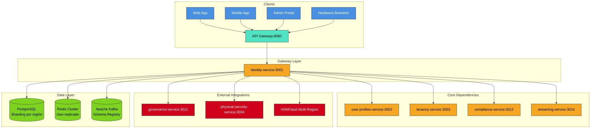

# 📘 Especificación Técnica: identity-service (Puerto 3001) — Versión 3.0

> **Metodología:** `github/spec-kit`  
> **Versión:** `3.0`  
> **Estado:** `En Revisión Arquitectónica`  
> **Última Actualización:** `2025-09-23`  
> **Alcance:** Proveedor central de identidad, autenticación, autorización y sesiones en entorno multi-tenant con cumplimiento GDPR/ARCO y Ley Nº 29733, con soporte expandido para autenticación biométrica y QR para integración transnacional.  
> **Visión Transnacional:** Servicio de identidad capaz de operar en múltiples jurisdicciones con adaptación local de políticas de autenticación y privacidad, soportando estándares internacionales y requisitos legales específicos por país.

---

## 🧭 1. Visión y Principios Estratégicos

### 1.1 Misión del Servicio
`identity-service` es el **núcleo de identidad digital transnacional** de SmartEdify, responsable de autenticar usuarios, gestionar sesiones, y proveer autorización en un entorno multi-país. En su versión 3.0, expande capacidades para soportar autenticación biométrica y por QR reutilizables across services.

### 1.2 Principios Fundamentales

| Principio | Implementación | Justificación Transnacional |
|-----------|----------------|----------------------------|
| **Zero-Trust + Multi-tenant** | Toda operación exige `tenant_id` + `country_code` | Cumplimiento regulatorio por jurisdicción |
| **Autenticación Universal** | Múltiples factores reutilizables (biometría, QR, WebAuthn) | Evitar duplicación entre servicios |
| **Privacidad por Diseño** | Minimización de datos, consentimiento granular | Adaptación a GDPR, LGPD, Ley 29733 |
| **Interoperabilidad Global** | Estándares OAuth 2.1, OIDC, FIDO2, DPoP | Compatibilidad con ecosistemas internacionales |
| **Residencia de Datos** | Políticas de almacenamiento por región | Cumplimiento de soberanía de datos |

---

## 🏗️ 2. Arquitectura y Diseño Global

### 2.1 Patrones Arquitectónicos Actualizados

| Componente | Decisión | Impacto Transnacional |
|------------|----------|----------------------|
| **API Layer** | REST JSON + GraphQL (para queries complejas) | Optimización para clients diversos |
| **AuthZ Perimetral** | Middleware en API_GATEWAY + Policy Decision Point | Baja latencia para validaciones frecuentes |
| **Gestión de Estado** | Redis Cluster geo-replicado + sticky sessions | Experiencia consistente cross-region |
| **Eventos** | Apache Kafka con Schema Registry | Estandarización de eventos across regions |
| **Biometría/QR** | Servicio centralizado con contextos específicos | Reutilización para governance, physical-access |
| **Claves Criptográficas** | HSM multi-región + Key Management por tenant | Seguridad y compliance regional |

### 2.2 Diagrama de Contexto Expandido



### 2.3 Estrategia de Datos Multi-Región

```sql
-- Configuración de residencia de datos por tenant
CREATE TABLE tenant_data_residency (
    tenant_id UUID PRIMARY KEY REFERENCES tenants(id),
    primary_region TEXT NOT NULL, -- 'us-east', 'eu-west', 'sa-east'
    backup_region TEXT,
    compliance_profile TEXT NOT NULL, -- 'GDPR', 'LGPD', 'LEY_29733'
    data_retention_days INTEGER NOT NULL DEFAULT 1095, -- 3 años por defecto
    created_at TIMESTAMPTZ DEFAULT NOW()
);
```

---

## 📦 3. Especificación Funcional Detallada

### 3.1 Gestión de Identidades Multi-País

**Registro Adaptativo por País:**
- Validación de documentos de identidad según país (DNI, CPF, NIE, etc.)
- Políticas de contraseña configurables por tenant/país
- Consentimientos legales específicos por jurisdicción
- Verificación de edad mínima según legislación local

**Flujo de Onboarding Internacional:**
```typescript
interface RegistrationFlow {
  country_code: string;
  required_fields: string[]; // Campos obligatorios por país
  identity_document: {
    type: string; // 'DNI', 'CPF', 'PASSPORT'
    validation_service: string; // Integración con servicios gubernamentales
  };
  consent_requirements: Consent[];
}
```

### 3.2 Autenticación Universal Expandida

#### Factores de Autenticación Soportados:
1. **Contraseña + Argon2id** (con rehash automático)
2. **TOTP** (Google Authenticator, Authy)
3. **WebAuthn/FIDO2** (claves de seguridad, Windows Hello)
4. **Biometría Nativa** (Touch ID, Face ID, Android BiometricPrompt)
5. **Tokens QR Contextuales** (para asistencia, acceso físico)
6. **Códigos SMS/Email** (fallback transaccional)

#### Nueva Arquitectura de Biometría y QR:

```sql
-- Modelo de datos para autenticación universal
CREATE TABLE authentication_factors (
    id UUID PRIMARY KEY DEFAULT gen_random_uuid(),
    identity_id UUID NOT NULL REFERENCES identities(id),
    factor_type TEXT NOT NULL, -- 'PASSWORD', 'TOTP', 'WEBAUTHN', 'BIOMETRIC', 'QR'
    credential_data JSONB NOT NULL, -- Datos específicos del factor
    status TEXT NOT NULL DEFAULT 'ACTIVE',
    created_at TIMESTAMPTZ DEFAULT NOW(),
    last_used_at TIMESTAMPTZ
);

-- Credenciales biométricas (cifradas en HSM)
CREATE TABLE biometric_credentials (
    id UUID PRIMARY KEY DEFAULT gen_random_uuid(),
    identity_id UUID NOT NULL REFERENCES identities(id),
    biometric_type TEXT NOT NULL, -- 'FINGERPRINT', 'FACE', 'VOICE'
    public_key BYTEA NOT NULL, -- Clave pública para verificación
    encrypted_private_key BYTEA NOT NULL, -- Cifrado con HSM
    device_identifier TEXT, -- Identificador del dispositivo
    assurance_level INTEGER NOT NULL DEFAULT 1, -- Nivel de confianza 1-3
    created_at TIMESTAMPTZ DEFAULT NOW()
);

-- Tokens QR para contextos específicos
CREATE TABLE contextual_tokens (
    token_hash TEXT PRIMARY KEY, -- Hash del token QR
    identity_id UUID NOT NULL REFERENCES identities(id),
    context_type TEXT NOT NULL, -- 'GOVERNANCE_ATTENDANCE', 'PHYSICAL_ACCESS'
    context_id UUID, -- ID del contexto específico (assembly_id, door_id)
    expires_at TIMESTAMPTZ NOT NULL,
    max_uses INTEGER DEFAULT 1,
    current_uses INTEGER DEFAULT 0,
    metadata JSONB, -- Datos adicionales del contexto
    created_at TIMESTAMPTZ DEFAULT NOW()
);
```

### 3.3 Gestión de Sesiones Transnacionales

**Estrategia de Sesiones Multi-Región:**
- **Sticky Sessions** con affinity por región
- **Replicación eventual** de sesiones críticas entre regiones
- **Logout global** con invalidación cross-region
- **Detección de anomalías** por ubicación geográfica

```yaml
session_config:
  default_ttl: 15m
  refresh_ttl: 30d
  regional_affinity: true
  cross_region_replication: 
    enabled: true
    regions: ["primary", "backup"]
  anomaly_detection:
    geographic_jumps: true
    device_fingerprinting: true
```

### 3.4 Autorización Adaptativa (RBAC + ABAC + ReBAC)

**Modelo Híbrido de Autorización:**
- **RBAC:** Roles tradicionales por tenant
- **ABAC:** Atributos contextuales (ubicación, dispositivo, hora)
- **ReBAC:** Relaciones entre recursos (propietario → unidad → condominio)

```sql
-- Modelo expandido de autorización
CREATE TABLE relationship_based_access (
    id UUID PRIMARY KEY DEFAULT gen_random_uuid(),
    tenant_id UUID NOT NULL REFERENCES tenants(id),
    source_type TEXT NOT NULL, -- 'USER', 'ROLE', 'GROUP'
    source_id UUID NOT NULL,
    relation TEXT NOT NULL, -- 'OWNER', 'MEMBER', 'ADMIN'
    target_type TEXT NOT NULL, -- 'UNIT', 'ASSEMBLY', 'DOCUMENT'
    target_id UUID NOT NULL,
    expires_at TIMESTAMPTZ,
    created_at TIMESTAMPTZ DEFAULT NOW()
);
```

---

## 🔌 4. Contrato de API Expandido

### 4.1 Endpoints Principales (Versión 3.0)

```plaintext
# ✅ Endpoints Existente (Mantenidos)
POST   /identity/v1/register
POST   /identity/v1/login
POST   /identity/v1/forgot-password
POST   /identity/v1/logout

# 🔄 Endpoints Actualizados (Nueva versión)
POST   /identity/v2/token/refresh              # Con detección de región
GET    /identity/v2/sessions/active            # Sesiones multi-dispositivo

# 🆕 Endpoints Nuevos (Biometría y QR)
# --- Gestión de Factores de Autenticación ---
POST   /identity/v2/auth-factors               # Registrar nuevo factor
GET    /identity/v2/auth-factors               # Listar factores del usuario
DELETE /identity/v2/auth-factors/{factor_id}   # Remover factor

# --- Biometría ---
POST   /identity/v2/biometrics/enroll          # Registrar credencial biométrica
POST   /identity/v2/biometrics/challenge       # Generar challenge para verificación
POST   /identity/v2/biometrics/verify          # Verificar biometría
GET    /identity/v2/biometrics/credentials     # Listar dispositivos biométricos

# --- Tokens Contextuales (QR) ---
POST   /identity/v2/contextual-tokens          # Generar token para QR
POST   /identity/v2/contextual-tokens/validate # Validar token escaneado
GET    /identity/v2/contextual-tokens/{token}  # Obtener metadata del token

# --- Autorización Relacional ---
POST   /identity/v2/relationships              # Establecer relación de acceso
GET    /identity/v2/relationships              # Consultar relaciones
DELETE /identity/v2/relationships/{rel_id}     # Revocar relación

# --- Gestión Transnacional ---
GET    /identity/v2/compliance/profiles        # Obtener perfiles de cumplimiento
POST   /identity/v2/consents                   # Registrar consentimiento específico
```

### 4.2 Ejemplo de Flujo de Biometría para Governance

```json
// 1. Governance-service solicita challenge biométrico
POST /identity/v2/biometrics/challenge
{
  "identity_id": "uuid-usuario",
  "context": {
    "type": "GOVERNANCE_ATTENDANCE",
    "assembly_id": "uuid-asamblea",
    "required_assurance_level": 2
  }
}

// 2. Identity-service retorna challenge
{
  "challenge_id": "uuid-challenge",
  "challenge": "base64-encoded-challenge",
  "expires_in": 300,
  "allowed_biometric_types": ["FACE", "FINGERPRINT"]
}

// 3. Cliente verifica biometría y envía respuesta
POST /identity/v2/biometrics/verify
{
  "challenge_id": "uuid-challenge",
  "signature": "base64-signature",
  "device_identifier": "device-id",
  "biometric_type": "FACE"
}

// 4. Identity-service valida y notifica a governance-service
{
  "success": true,
  "identity_id": "uuid-usuario",
  "assurance_level": 2,
  "attendance_token": "token-de-asistencia"
}
```

---

## 🛡️ 5. Seguridad y Cumplimiento Transnacional

### 5.1 Hardening de Seguridad

**Protección de Datos Biométricos:**
```yaml
biometric_security:
  storage: 
    private_keys: "HSM"  # Nunca en base de datos
    public_keys: "Database"  # Solo para verificación
  encryption:
    algorithm: "RSA-OAEP-256"
    key_rotation: "30d"
  transmission:
    format: "FIDO2 attestation"
    channel: "TLS 1.3 only"
```

**Prevención de Ataques Específicos:**
- **Replay Attacks:** Challenges con nonce y expiración corta
- **Biometric Spoofing:** Niveles de assurance y liveness detection
- **QR Hijacking:** Tokens de un solo uso con binding contextual

### 5.2 Cumplimiento Regulatorio por País

```sql
-- Tabla de configuraciones de cumplimiento
CREATE TABLE compliance_configurations (
    country_code TEXT PRIMARY KEY,
    data_retention_days INTEGER NOT NULL,
    consent_required BOOLEAN DEFAULT true,
    biometric_regulation JSONB, -- Leyes específicas de biometría
    age_of_consent INTEGER,
    special_requirements JSONB,
    updated_at TIMESTAMPTZ DEFAULT NOW()
);

-- Inserciones iniciales
INSERT INTO compliance_configurations VALUES 
('PE', 1095, true, '{"law": "29733", "biometric_consent": "explicit"}', 18, '{}'),
('ES', 730, true, '{"law": "GDPR", "biometric_consent": "explicit"}', 16, '{}'),
('BR', 1825, true, '{"law": "LGPD", "biometric_consent": "explicit"}', 18, '{}');
```

---

## 📈 6. Observabilidad y Monitoreo Global

### 6.1 Métricas Clave Expandidas

```yaml
metrics:
  # Métricas de negocio transnacional
  - identity.registrations_total{country, tenant_type}
  - identity.authentication_methods_total{method, country}
  - identity.biometric_enrollments_total{type, assurance_level}
  - identity.contextual_tokens_used_total{context_type, country}
  
  # Métricas de seguridad
  - identity.failed_attempts_total{reason, country}
  - identity.anomalous_logins_total{detection_type}
  - identity.consent_changes_total{country}
  
  # Métricas de rendimiento cross-region
  - identity.auth_latency_seconds_bucket{region, endpoint}
  - identity.session_replication_latency_seconds{region}
```

### 6.2 Trazas Distribuidas para Flujos Transnacionales

```json
{
  "trace_id": "transnational-auth-flow",
  "spans": [
    {"service": "identity-service", "operation": "biometric_challenge", "region": "sa-east"},
    {"service": "compliance-service", "operation": "validate_consent", "region": "global"},
    {"service": "governance-service", "operation": "register_attendance", "region": "sa-east"}
  ]
}
```

---

## 🚀 7. Plan de Implementación Priorizado

### Fase 1: Cimientos Críticos (Sprint 1-2)

**Objetivo:** Establecer base sólida para expansión transnacional

1. **✅ Refactorización de Modelo de Datos**
   - Migrar a nuevas tablas de factores de autenticación
   - Implementar `tenant_data_residency`
   - Crear índices para queries multi-tenant eficientes

2. **✅ API Contextual Tokens (QR)**
   - Implementar generación/validación de tokens
   - Integración inicial con governance-service
   - Mecanismos de expiración y single-use

3. **✅ Estandarización de Eventos**
   - Migrar a Apache Kafka
   - Definir schema registry para eventos de identidad
   - Implementar producers para nuevos eventos

### Fase 2: Capacidades Avanzadas (Sprint 3-4)

**Objetivo:** Habilitar autenticación biométrica y autorización relacional

4. **🔄 Implementación de Biometría**
   - Integración con HSM para claves biométricas
   - APIs de enrolamiento y verificación
   - Mecanismos de challenge-response

5. **🔄 Autorización Relacional (ReBAC)**
   - Modelo de relaciones entre entidades
   - Motor de evaluación de políticas
   - Integración con services existentes

6. **🔄 Circuit Breaker y Resiliencia**
   - Implementar Resilience4j para dependencias críticas
   - Timeouts y retries configurables por región
   - Fallback strategies para compliance-service

### Fase 3: Hardening Transnacional (Sprint 5-6)

7. **🔒 Seguridad y Cumplimiento**
   - Implementar DPOP/MTLS para servicios internos
   - Políticas de retención de datos por país
   - Auditoría y reporting para compliance

8. **🌐 Optimización Multi-Región**
   - Configuración de Redis cluster geo-replicado
   - Estrategia de cache distribuido
   - Load balancing basado en ubicación

---

## 📊 8. Criterios de Aceptación Transnacionales

### 8.1 Funcionales
- [ ] Usuario puede registrar múltiples factores de autenticación
- [ ] Biometría funciona consistentemente across dispositivos/regiones
- [ ] Tokens QR son válidos solo en contexto específico
- [ ] Políticas de consentimiento se aplican según país del tenant

### 8.2 No Funcionales
- [ ] Autenticación biométrica < 2s P95 across regions
- [ ] APIs responden < 200ms P99 para operaciones críticas
- [ ] Sistema soporta 10M+ usuarios con distribución global
- [ ] Cumplimiento demostrable con GDPR, LGPD, Ley 29733

### 8.3 Seguridad
- [ ] Datos biométricos nunca expuestos en tránsito/reposo
- [ ] Tokens QR resistentes a replay attacks
- [ ] Auditoría completa de acceso a datos sensibles
- [ ] Certificación SOC2 Type II para infraestructura

---

## 🔮 9. Roadmap Evolutivo

### Q4 2025 - Lanzamiento Core
- Biometría y QR para governance-service
- Soporte multi-región básico
- Cumplimiento Perú (Ley 29733)

### Q1 2026 - Expansión LATAM
- Soporte Brasil (LGPD) y Chile
- Optimizaciones de performance regional
- Integración con servicios gubernamentales

### Q2 2026 - Entrada Europa
- Certificación GDPR completa
- Soporte para eIDAS (identificación electrónica)
- Integración con proveedores europeos

---

## ✅ 10. Conclusión

**identity-service v3.0** establece los cientos para una **plataforma de identidad transnacional** que combina seguridad de clase enterprise con flexibilidad para adaptarse a regulaciones locales. La arquitectura descentraliza la lógica de autenticación mientras centraliza la gestión de identidad, creando un sistema escalable y compliant.

Las **capacidades de biometría y QR** posicionan a SmartEdify como líder en autenticación moderna, mientras que la **infraestructura multi-región** asegura performance y cumplimiento en la expansión global.

**Próximos pasos inmediatos:** Revisión arquitectónica con equipos de governance y compliance para alinear interfaces y flujos de integración.

---

**© 2025 SmartEdify Global. Todos los derechos reservados.**  
*Documento de especificación técnica - Versión 3.0*


---

✅ 14. Cierre

identity-service consolida la identidad de la plataforma con estándares, seguridad reforzada, cumplimiento legal y una DX clara. La arquitectura habilita escalabilidad y control fino por tenant con trazabilidad completa.

