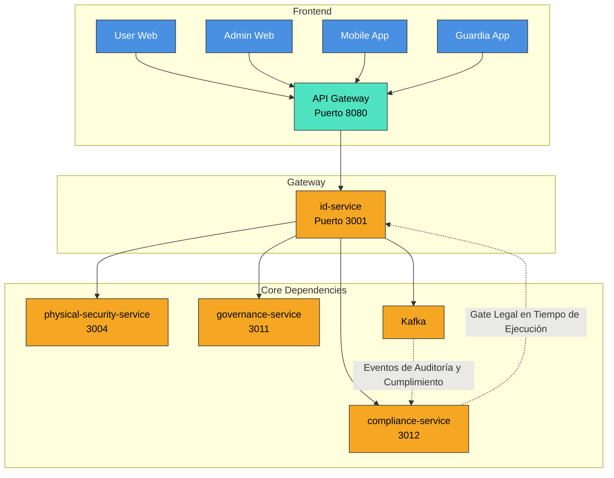

# 📘 Especificación Técnica: identity-service (Puerto 3001) — Versión 3.0

> **Metodología:** `github/spec-kit`  
> **Versión:** `3.0`  
> **Estado:** `En Revisión Arquitectónica`  
> **Última Actualización:** `2025-09-23`  
> **Alcance:** Proveedor central de identidad, autenticación, autorización y sesiones en entorno multi-tenant, con soporte expandido para autenticación biométrica y QR para integración transnacional.  
> **Visión Transnacional:** Servicio de identidad capaz de operar en múltiples jurisdicciones con adaptación local de políticas de autenticación y privacidad, soportando estándares internacionales y requisitos legales específicos por país.

---


## 🧭 **1. Visión y Justificación**

El `identity-service` es la **puerta de entrada segura y legalmente válida** a la plataforma SmartEdify. Su misión es gestionar la identidad digital de todos los actores (residentes, administradores, guardias, sistemas) con un **nivel de aseguramiento adaptativo (AAL2/AAL3)**, garantizando la privacidad, la seguridad y el cumplimiento normativo en cada jurisdicción.

Este servicio actúa como el **“sistema nervioso central” de la seguridad y el cumplimiento**, integrando estándares técnicos de vanguardia (WebAuthn L3, DPoP, OAuth 2.0 BCP) y normativas legales globales (GDPR, Perú DS 016-2024-JUS), con el `compliance-service` como el **“gate legal en tiempo de ejecución”** que valida y autoriza cada operación crítica.

---

## 🏗️ **2. Arquitectura y Diseño Global**

### **2.1. Patrones Arquitectónicos Clave**

| Patrón | Implementación | Justificación |
|--------|----------------|---------------|
| **Identity Provider (IdP)** | Implementación estándar de OpenID Connect (OIDC) y OAuth 2.0. | Estándar de la industria para federación de identidad. |
| **Zero Trust Architecture** | Verificación explícita de cada acceso, incluso desde dentro de la red. | Mitiga amenazas internas y externas. |
| **Event-Driven Architecture** | Emite eventos de auditoría y cumplimiento a Kafka para procesamiento asíncrono. | Desacopla la lógica de negocio de la de cumplimiento y auditoría. |
| **Policy-Based Access Control (PBAC)** | Motor de políticas (OPA/Cedar) para autorización híbrida (RBAC + ABAC + ReBAC). | Flexibilidad para definir reglas complejas de acceso basadas en contexto. |
| **Privacy by Design** | Minimización de datos, cifrado end-to-end, portabilidad y eliminación de datos. | Cumplimiento con GDPR, LGPD, Ley 29733 y DS 016-2024-JUS. |
| **Runtime Compliance Enforcement** | El `compliance-service` valida políticas de retención, DSAR, transferencias y requisitos por país **en cada operación crítica** (registro, login, emisión de QR). | Cumplimiento proactivo, no solo en release. |

### **2.2. Diagrama de Contexto (Mermaid)**



---

## 📦 **3. Especificación Funcional Detallada**

### **3.1. Gestión de Identidad y Registro**

*   **Registro Adaptable por País y Tenant:**
    *   El flujo de registro se personaliza según el país y el reglamento interno del tenant.
    *   Campos obligatorios: Nombre, Email, Teléfono, DNI/RUC (según país).
    *   **¡CORREGIDO!** El `dni` **NO se almacena en `identity-service`**. Se mueve a `user-profiles-service` o se cifra determinísticamente con KMS y se clasifica como dato sensible.
    *   Validación de email y teléfono vía OTP.
    *   Consentimientos explícitos para tratamiento de datos, uso de biometría y grabación de video (GDPR, Ley 29733, DS 016-2024-JUS).

### **3.2. Autenticación (Baseline Técnico: NIST 800-63-4)**

*   **Métodos de Autenticación:**
    *   **Primario: WebAuthn/Passkeys (AAL2/AAL3):** El método preferido. El backend almacena solo `credentialId`, `publicKey` y `signCount`. **NUNCA almacena plantillas biométricas ni claves privadas.**
    *   **Secundario: TOTP (AAL2):** Para usuarios que no pueden usar Passkeys.
    *   **Fallback: Password + Argon2id (AAL1):** Solo si no hay otra opción. Validación contra listas de contraseñas comprometidas. **¡CORREGIDO!** Prohibir reset solo con SMS/Email; exigir AAL2 o verificación reforzada.
    *   **Contingencia: SMS/Email (AAL1):** Solo para recuperación de cuenta o en caso de fallo de otros métodos.
*   **MFA Adaptativo:**
    *   Se exige MFA (TOTP o Passkey) para operaciones de alto riesgo (cambio de contraseña, acceso a datos sensibles, firma de actas) o según la política de riesgo definida por el `compliance-service`.

### **3.3. Autorización Híbrida (RBAC + ABAC + ReBAC)**

*   **Motor de Políticas Centralizado:**
    *   Implementación de un PDP (Policy Decision Point) basado en OPA/Cedar.
    *   Las políticas se definen en lenguaje declarativo y se almacenan en un repositorio versionado.
    *   **¡CORREGIDO!** Cache regional, “fail-closed”, pruebas de regresión de políticas y explicación de decisión.
*   **Modelo de Acceso:**
    *   **RBAC (Role-Based):** Roles predefinidos (`RESIDENT`, `ADMIN`, `GUARD`, `SYSTEM`).
    *   **ABAC (Attribute-Based):** Políticas basadas en atributos del usuario, recurso y contexto (hora, ubicación, dispositivo).
    *   **ReBAC (Relationship-Based):** Políticas basadas en relaciones (ej: un `RESIDENT` solo puede acceder a los datos de su `UNIT` y su `CONDOMINIUM`).
*   **PEP (Policy Enforcement Point):**
    *   Integrado en el `API Gateway` y en sidecars de los microservicios.

### **3.4. Gestión de Sesiones y Tokens (Baseline Técnico: OAuth 2.0 BCP + DPoP)**

*   **Tokens de Acceso (JWT):**
    *   Vida útil: ≤ 10 minutos.
    *   Formato: JWT firmado (JWS) con `alg: ES256`.
    *   Contenido: `sub`, `iss`, `aud`, `exp`, `iat`, `jti`, `scope`, `tenant_id`, `region`, `cnf` (Proof-of-Possession).
*   **Tokens de Actualización (Refresh):**
    *   **¡CORREGIDO!** Rotación obligatoria: Cada uso genera un nuevo refresh token.
    *   **Reuse Detection:** El sistema detecta y revoca todos los tokens si se intenta reutilizar un refresh token.
    *   **Sender-Constrained:** Atado al dispositivo mediante DPoP (RFC 9449). El JWT del refresh token incluye el claim `cnf` con el `jkt` (JWK Thumbprint) de la clave pública del cliente.
    *   **¡CORREGIDO!** Tabla `refresh_tokens` ampliada con `family_id`, `parent_id`, `replaced_by_id`, `used_at`, `client_id`, `device_id`, `session_id`, `scope`, `created_ip`, `created_ua`, `revoked_reason`.
*   **Logout Global:**
    *   Tiempo de revocación P95 ≤ 30 segundos.
    *   **¡CORREGIDO!** Implementado mediante **versión de sesión** por dispositivo, “not-before” por `sub`, y eventos de revocación distribuidos (no solo lista negra en Redis).

### **3.5. Generación y Validación de QR Contextuales Firmados**

*   **Generación de QR:**
    *   El `identity-service` genera un token contextual firmado (COSE/JWS) para eventos como asambleas o acceso físico.
    *   El payload del token incluye: `iss`, `aud`, `sub`, `jti`, `nbf`, `exp`, `cnf` (para Proof-of-Possession), `event_id`, `location`.
    *   **¡CORREGIDO!** Define TTL cortos, `jti` único y lista de revocación para pérdida/robo.
*   **Validación de QR:**
    *   El `physical-security-service` o el `governance-service` valida el QR llamando al endpoint `POST /identity/v2/contextual-tokens/validate`.
    *   La validación incluye: verificación de firma, `aud`, `nbf`/`exp`, y `cnf` (Proof-of-Possession).
    *   **¡CORREGIDO!** Exige DPoP en validación y `aud` específico por servicio.

### **3.6. Cumplimiento y Derechos del Titular (DSAR) en Tiempo de Ejecución**

*   **Notificación de Brechas (Breach-Notify):**
    *   Orquestado por el `compliance-service`.
    *   Plazos: ≤ 48 horas a la autoridad peruana (DS 016-2024-JUS), ≤ 72 horas a la autoridad europea (GDPR Art. 33).
*   **Portabilidad y Eliminación de Datos (DSAR):**
    *   Endpoints: `POST /privacy/export` y `DELETE /privacy/data`.
    *   **¡CORREGIDO!** Operaciones asíncronas con `job_id` y webhooks de finalización.
    *   Requiere autenticación fuerte (AAL2) y verificación adicional (OTP o Passkey).
    *   Genera un informe de auditoría con sello de tiempo.
*   **¡CORREGIDO! Enforcement Runtime:**
    *   El `compliance-service` valida políticas de retención, DSAR, transferencias y requisitos por país **en cada operación crítica** (registro, login de alto riesgo, emisión de QR).

---

## ⚙️ **4. Modelo de Datos (Resumen — ¡CORREGIDO!)**

```sql
-- Tabla: users (¡CORREGIDO!)
CREATE TABLE users (
    id UUID PRIMARY KEY DEFAULT gen_random_uuid(),
    tenant_id UUID NOT NULL,
    username TEXT NOT NULL,
    email TEXT NOT NULL,
    phone TEXT,
    -- ¡CORREGIDO! dni MOVIDO a user-profiles-service o cifrado en identity-service
    -- dni TEXT, -- ¡ELIMINADO!
    status TEXT NOT NULL DEFAULT 'ACTIVE', -- ACTIVE, INACTIVE, LOCKED
    email_verified_at TIMESTAMPTZ,
    phone_verified_at TIMESTAMPTZ,
    preferred_login TEXT, -- 'PASSWORD', 'TOTP', 'WEBAUTHN'
    created_at TIMESTAMPTZ NOT NULL DEFAULT NOW(),
    updated_at TIMESTAMPTZ NOT NULL DEFAULT NOW(),
    UNIQUE(tenant_id, username), -- ¡CORREGIDO! Único por tenant
    UNIQUE(tenant_id, email)     -- ¡CORREGIDO! Único por tenant
);

-- Tabla: webauthn_credentials (¡CORREGIDO!)
CREATE TABLE webauthn_credentials (
    id UUID PRIMARY KEY DEFAULT gen_random_uuid(),
    user_id UUID NOT NULL REFERENCES users(id),
    credential_id BYTEA NOT NULL, -- Almacenado en base64url
    public_key BYTEA NOT NULL, -- Almacenado en formato COSE
    sign_count BIGINT NOT NULL DEFAULT 0,
    rp_id TEXT NOT NULL, -- ¡CORREGIDO!
    origin TEXT NOT NULL, -- ¡CORREGIDO!
    aaguid BYTEA, -- ¡CORREGIDO!
    attestation_fmt TEXT, -- ¡CORREGIDO!
    transports TEXT[], -- ¡CORREGIDO!
    backup_eligible BOOLEAN, -- ¡CORREGIDO!
    backup_state TEXT, -- ¡CORREGIDO!
    cred_protect TEXT, -- ¡CORREGIDO!
    last_used_at TIMESTAMPTZ, -- ¡CORREGIDO!
    created_at TIMESTAMPTZ NOT NULL DEFAULT NOW(),
    UNIQUE(user_id, credential_id) -- ¡CORREGIDO!
);

-- Tabla: refresh_tokens (¡CORREGIDO!)
CREATE TABLE refresh_tokens (
    id UUID PRIMARY KEY DEFAULT gen_random_uuid(),
    token_hash TEXT NOT NULL, -- SHA-256 del token
    user_id UUID NOT NULL REFERENCES users(id),
    jkt TEXT NOT NULL, -- JWK Thumbprint de la clave pública del cliente (para DPoP)
    family_id UUID NOT NULL, -- ¡CORREGIDO!
    parent_id UUID REFERENCES refresh_tokens(id), -- ¡CORREGIDO!
    replaced_by_id UUID REFERENCES refresh_tokens(id), -- ¡CORREGIDO!
    used_at TIMESTAMPTZ, -- ¡CORREGIDO!
    client_id TEXT NOT NULL, -- ¡CORREGIDO!
    device_id TEXT NOT NULL, -- ¡CORREGIDO!
    session_id UUID NOT NULL, -- ¡CORREGIDO!
    scope TEXT NOT NULL, -- ¡CORREGIDO!
    expires_at TIMESTAMPTZ NOT NULL,
    created_ip TEXT, -- ¡CORREGIDO!
    created_ua TEXT, -- ¡CORREGIDO!
    revoked BOOLEAN NOT NULL DEFAULT false,
    revoked_reason TEXT, -- ¡CORREGIDO!
    created_at TIMESTAMPTZ NOT NULL DEFAULT NOW()
);

-- Tabla: sessions (¡NUEVA! ¡CORREGIDO!)
CREATE TABLE sessions (
    id UUID PRIMARY KEY DEFAULT gen_random_uuid(),
    user_id UUID NOT NULL REFERENCES users(id),
    tenant_id UUID NOT NULL,
    device_id TEXT NOT NULL,
    cnf_jkt TEXT NOT NULL, -- JWK Thumbprint del DPoP key bound to this session
    issued_at TIMESTAMPTZ NOT NULL DEFAULT NOW(),
    not_after TIMESTAMPTZ NOT NULL, -- ¡CORREGIDO! para revocación
    revoked_at TIMESTAMPTZ, -- ¡CORREGIDO!
    version INT NOT NULL DEFAULT 1, -- ¡CORREGIDO! para revocación
    created_at TIMESTAMPTZ NOT NULL DEFAULT NOW()
);

-- Tabla: consent_audits (¡CORREGIDO!)
CREATE TABLE consent_audits (
    id UUID PRIMARY KEY DEFAULT gen_random_uuid(),
    user_id UUID NOT NULL REFERENCES users(id),
    consent_type TEXT NOT NULL, -- 'DATA_PROCESSING', 'BIOMETRIC', 'VIDEO_RECORDING'
    consent_granted BOOLEAN NOT NULL,
    granted_at TIMESTAMPTZ NOT NULL DEFAULT NOW(),
    ip_address TEXT,
    user_agent TEXT,
    policy_version TEXT, -- ¡CORREGIDO!
    purpose TEXT, -- ¡CORREGIDO!
    country_code TEXT, -- ¡CORREGIDO!
    evidence_ref TEXT -- ¡CORREGIDO!
);

-- Tabla: revocation_events (¡NUEVA! ¡CORREGIDO!)
CREATE TABLE revocation_events (
    id UUID PRIMARY KEY DEFAULT gen_random_uuid(),
    type TEXT NOT NULL, -- 'token', 'session', 'subject'
    subject UUID NOT NULL, -- user_id or session_id
    tenant_id UUID NOT NULL,
    session_id UUID, -- ¡CORREGIDO!
    jti TEXT, -- ¡CORREGIDO!
    not_before TIMESTAMPTZ NOT NULL, -- ¡CORREGIDO!
    created_at TIMESTAMPTZ NOT NULL DEFAULT NOW()
);
```

---

## 🔌 **5. Contrato de API (Endpoints Clave — ¡CORREGIDO!)**

```plaintext
# Discovery y Claves (OIDC)
GET /.well-known/openid-configuration?tenant_id={id} -- ¡CORREGIDO!
GET /.well-known/jwks.json?tenant_id={id} -- ¡CORREGIDO!

# OIDC/OAuth Obligatorios (¡CORREGIDO!)
GET /authorize -- ¡CORREGIDO!
POST /oauth/par -- ¡CORREGIDO!
POST /oauth/token
POST /oauth/introspect -- ¡CORREGIDO!
POST /oauth/revoke -- ¡CORREGIDO!
POST /oauth/device_authorization -- ¡CORREGIDO!
POST /logout -- ¡CORREGIDO!
POST /backchannel-logout -- ¡CORREGIDO!

# Tokens y Sesiones
POST /oauth/token
POST /identity/v2/token/refresh -- ¡CORREGIDO! DPoP requerido, rotación y reuse detection
GET /identity/v2/sessions/active -- ¡CORREGIDO! incluir device_id, cnf_jkt, issued_at, version
POST /identity/v2/sessions/{id}/revoke -- ¡CORREGIDO!
POST /identity/v2/subject/revoke -- ¡CORREGIDO! (establecen not_before)

# WebAuthn
POST /webauthn/attestation/options
POST /webauthn/attestation/result
POST /webauthn/assertion/options
POST /webauthn/assertion/result

# QR contextuales
POST /identity/v2/contextual-tokens -- ¡CORREGIDO! devuelve COSE/JWS con jti, aud, nbf/exp, cnf
POST /identity/v2/contextual-tokens/validate -- ¡CORREGIDO! exige DPoP, verifica aud, htu/htm, jti no usado

# Cumplimiento y DSAR
POST /compliance/incidents -- con perfiles por país y plazos automáticos
POST /privacy/export -- ¡CORREGIDO! asíncrono con job_id
DELETE /privacy/data -- ¡CORREGIDO! asíncrono con job_id

# Errores y DX
-- Respuestas RFC-7807.
-- Idempotencia en POST sensibles con `Idempotency-Key`.
```

---

## 🛡️ **6. Seguridad y Cumplimiento (¡CORREGIDO!)**

*   **Multi-Tenant:**
    *   **¡CORREGIDO!** RLS (Row-Level Security) activado en todas las tablas por `tenant_id`.
    *   Sharding/residencia por región.
*   **PII:**
    *   **¡CORREGIDO!** `dni` movido a `user-profiles-service` o cifrado determinísticamente en `identity-service`.
    *   Emails/phones normalizados (E.164) y verificados.
    *   0 PII en logs.
*   **Compliance en Tiempo de Ejecución:**
    *   **¡CORREGIDO!** El `compliance-service` aplica políticas de retención, DSAR, transferencias y requisitos por país **en cada operación crítica**.
*   **DPoP:**
    *   **¡CORREGIDO!** Validación `jti + (htu, htm)` con TTL por pareja clave-cliente, replicado entre regiones.
    *   Cache anti-replay distribuida.
*   **Revocación:**
    *   **¡CORREGIDO!** Access ≤10 min, **versión de sesión** por dispositivo, “not-before” por `sub`, y eventos de revocación distribuidos.
*   **WebAuthn:**
    *   **¡CORREGIDO!** Campos completos: `rp_id`, `origin`, `aaguid`, `attestation fmt`, `transports`, `backup_eligible/state`, `cred_protect`, `last_used_at`.
*   **Transferencias Internacionales:**
    *   **¡CORREGIDO!** Motor de rutas de datos por país/tenant también en **Kafka/backups**.
*   **Rate-limits y Anti-enumeración:**
    *   **¡CORREGIDO!** Por `tenant_id`, usuario, IP/ASN. Respuestas homogéneas en errores de login/recuperación.

---

## 📈 **7. Observabilidad y Monitoreo (¡CORREGIDO!)**

*   **Métricas Clave (Prometheus — ¡CORREGIDO!):**
    *   `auth_latency_seconds{method,region}` -- ¡CORREGIDO!
    *   `login_success_total{method="PASSKEY", "TOTP", "PASSWORD"}`
    *   `login_failure_total{reason="INVALID_CREDENTIAL", "EXPIRED_TOKEN"}`
    *   `token_refresh_total`
    *   `logout_global_p95_seconds`
    *   `dsar_export_total`, `dsar_delete_total`
    *   `breach_notify_pe_48h_total`, `breach_notify_eu_72h_total`
    *   `dpop_replay_denied_total` -- ¡CORREGIDO!
    *   `refresh_reuse_detected_total` -- ¡CORREGIDO!
    *   `policy_denied_total` -- ¡CORREGIDO!
    *   `login_enumeration_blocked_total` -- ¡CORREGIDO!
*   **Trazas Distribuidas (OpenTelemetry):**
    *   `tenant_id`, `region`, `user_id`, `auth_method`, `assurance_level`.
*   **Auditoría WORM (Write-Once-Read-Many):**
    *   **¡CORREGIDO!** Todos los eventos críticos (login, logout, cambio de contraseña, DSAR, breach) se almacenan en un sistema WORM con hash-chain y sellado periódico. Verificación mensual.

---

## ✅ **8. Criterios de Aceptación (Definition of Done — ¡CORREGIDO!)**

1.  **95% de logins con Passkeys.** El resto debe usar MFA (TOTP o SMS) bajo política de riesgo.
2.  **Logout global P95 ≤ 30 segundos.** -- ¡CORREGIDO!
3.  **Endpoints `/.well-known` y JWKS por tenant operativos.** -- ¡CORREGIDO!
4.  **DPoP activo y funcional en todos los tokens de acceso y refresh. Reuse detection probado.** -- ¡CORREGIDO!
5.  **QR contextuales firmados y vinculados a PoP, no reutilizables.** -- ¡CORREGIDO!
6.  **Breach-notify y DSAR ejecutados de extremo a extremo.** -- ¡CORREGIDO!
7.  **0 almacenamiento de plantillas biométricas o claves privadas en el backend. WebAuthn L3 vigente.** -- ¡CORREGIDO!
8.  **Pruebas de reuse detection y anti-replay DPoP.** -- ¡CORREGIDO!
9.  **Revocación por `subject` efectiva ≤30 s global.** -- ¡CORREGIDO!
10. **Política de retención por categoría activa y testeada.** -- ¡CORREGIDO!

---

## 🚀 **9. Hoja de Ruta y Migración (¡CORREGIDO!)**

*   **Fase 1 (Sprint 1-2):** Implementar tokens stateless, DPoP, Discovery/JWKS por tenant y DSAR básico asíncrono.
*   **Fase 2 (Sprint 3-4):** Implementar WebAuthn completo, PDP unificado, QR COSE/JWS, y revocación por sesión/subject.
*   **Fase 3 (Sprint 5-6):** Implementar auditoría WORM, automatización de notificaciones legales por país, y cache anti-replay DPoP multi-región.

---

## ⚠️ **10. Riesgos y Mitigaciones (¡CORREGIDO!)**

| Riesgo | Mitigación |
|--------|------------|
| **Robo de token de acceso/refresh.** | DPoP (sender-constrained) + rotación de refresh tokens + reuse detection. -- ¡CORREGIDO! |
| **Desalineación legal entre países.** | `compliance-service` como gate de release Y en tiempo de ejecución. Simulacros trimestrales de brecha y DSAR. -- ¡CORREGIDO! |
| **Latencia en autenticación inter-región.** | Cachés no autoritativas de JWKS y políticas. Colas de eventos regionales. -- ¡CORREGIDO! |
| **Migración a Passkeys.** | Compatibilidad con password y campañas de enrolamiento. -- ¡CORREGIDO! |
| **Fallo de Redis/Kafka/KMS/HSM.** | Estrategias de caos engineering. Blue/green + canary. Migraciones expand-contract. -- ¡CORREGIDO! |

---

## ✅ **11. Conclusión**

Esta especificación corregida del `identity-service` v3.1 establece un **estándar global de excelencia en gestión de identidad digital**. Al combinar los requisitos técnicos más avanzados (WebAuthn L3, DPoP, NIST 800-63-4) con los marcos legales más estrictos (GDPR, DS 016-2024-JUS) y **aplicar el cumplimiento en tiempo de ejecución**, SmartEdify no solo protege a sus usuarios, sino que se posiciona como la plataforma más segura y confiable del mercado.

El `compliance-service` como gate legal en tiempo de ejecución asegura que cada operación cumpla con la normativa aplicable, convirtiendo el cumplimiento de un costo en una **ventaja competitiva insuperable**.

---

**© 2025 SmartEdify Global. Todos los derechos reservados.**  
*Documento generado automáticamente a partir de la especificación técnica.*
